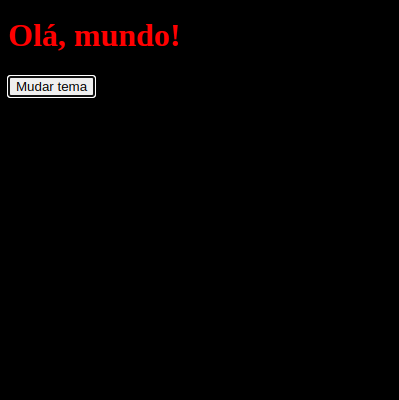

# Propriedades CSS para temas fáceis de fazer e usar



CSS custom properties, ou variáveis CSS, são uma maneira de definir valores que podem ser reutilizados em um documento CSS. Elas são definidas usando a notação `--nome-da-variavel` e podem ser usadas em qualquer lugar em que você usaria um valor normal. Além disso, elas podem ser definidas em diferentes escopos, alteradas dinamicamente com JavaScript e como CSS é declarativo trocar o tema de um site é rápido e fácil.

```css
:root {
	--cor-primaria: #007bff; /* azul */
	--cor-secundaria: #6c757d; /* cinza */
}

:root.vampiresco {
	--cor-primaria: #ff0000; /* vermelho */
	--cor-secundaria: #000000; /* preto */
}
```

Dá para trocar o tema de um site com um botão e um pouco de CSS:

```html
<!doctype html>
<html>
	<head>
		<link rel="stylesheet" href="styles.css" />
	</head>
	<body>
		<button onclick="document.documentElement.classList.toggle('vampiresco')">Mudar tema</button>
	</body>
</html>
```

```css
body {
	background-color: var(--cor-secundaria);
	color: var(--cor-primaria);
}
```

Sem depender de JavaScript para trocar os valores das variáveis :)

### Outras ideias:

- Adicionar um atributo no `html` para trocar o tema baseado em um cookie ou preferência do usuário para evitar o "flash" de conteúdo não estilizado.
- Usar variáveis CSS para deixar que o usuário escolha as cores do tema.
- Usar variáveis CSS para definir tamanhos de fontes, espaçamentos e outras propriedades que podem ser alteradas facilmente.
- Usar variáveis CSS com valores hsl para deixar seus estilos com Tailwind mais consistentes.
- Aproveitar o seletor `:has` para mudar o tema com base no estado de um `input[type="checkbox"]` ou `input[type="radio"]` — sem precisar de JavaScript.

Enfim, muitas possibilidades! 🎨
