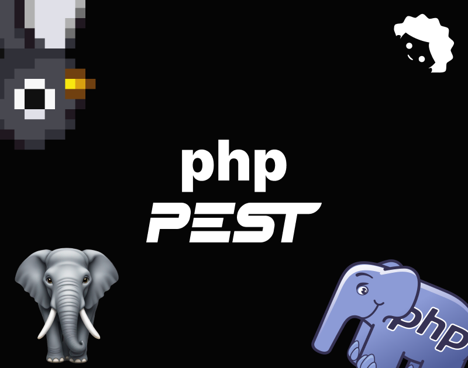

## 🧪 UNIT TESTS - TESTES UNITÁRIOS



É uma boa dar uma olhada na documentação:
[Documentação do Pest](https://pestphp.com/)

## Alguns sites, vídeos e repositórios úteis

- [Vídeo do Dias de Dev](https://www.youtube.com/watch?v=1oTRpTPEyX0&ab_channel=DiasdeDev)
- [Os três tipos de testes unitários](https://www.youtube.com/watch?v=W40mpZP9xQQ&t=173s&ab_channel=ContinuousDelivery)

## 🧹 Prepare seu ambiente de testes

Neste caso escolhi o framework de testes `Pest` por ser capaz de rodar testes do `PHP Unit` além de ter a própria API de testes que oferece uma experiência de desenvolvimento mais agradável.

> É válido lembrar que os testes rodaram apenas em ambiente de desenvolvimento.

```bash
# Instalando o pest e iniciando
composer require pestphp/pest --dev --with-all-dependencies
./vendor/bin/pest --init
```

```bash
# Cria uma pasta para seus testes unitários
mkdir tests/Unit
```

```bash
# Roda os testes
./vendor/bin/pest
```

## 🧐 Convenções de nomes de testes no Pest

> No pest é necessário colocarmos um sufixo no nome dos nossos arquivos de testes. O sufixo será aquele definido no arquivo phpunit.xml. Por padrão o sufixo é Test.php.

```text
|tests
   |
   ---|Unit
        |
        ----|TremTest.php
```

## 🧐 Convenções de nomes de testes no PHPUnit

> Quando vamos testar uma classe o padrão para definir o nome do teste é a combinação do nome da classe com a palavra "Test". Não precisamos nos preocupar tanto com isso no momento pois vamos estar usando o pest.

```php
// Classe
class XmlConverter {

}

// Teste
class XmlConverterTest extends PHPUnit\Framework\TestCase {

}
```

## 🦴 Estrutura dos testes no Pest

> No Pest podemos usar duas funções principais para definir um test:

```php
test('garante que true é igual a true', function () {
    $this->assertTrue(true);
    expect(true)->toBeTrue();
});

it('garante que true é igual a true', function () {
    $this->assertTrue(true);
    expect(true)->toBeTrue();
});
```

Basicamente a estrutura é composta pela chamada da função `test()` ou `it()` passando como parâmetro a mensagem do teste e a função que rodará o teste, essa função estende por padrão as funcionalidades da classe `TestCase`. A única diferença entre as duas é que quando usamos `it()` ele mostra a mensagem de teste com um "it" antes.

## 📜 SCRIPTS ÚTEIS PARA RODAR SEUS TESTES

Adicione os scripts abaixo em seu `composer.json` para facilitar a execução dos testes.

```json
"scripts": {
    "dev": "xdg-open 'http://localhost:3333'; php -S localhost:3333",
    "test": "./vendor/bin/pest",
    "coverage": "./vendor/bin/pest --coverage"
}
```

## 🧑‍⚖️ TESTES DE PRIMEIRA ORDEM

```php
// Código
function fazedorDeCoisas(){
    return true;
}

// Teste
it("faz alguma coisa")->assertTrue(fazedorDeCoisas());

// A linha acima equivale a:
it("faz alguma coisa", function() {
    $this->assertTrue(fazedorDeCoisas());
});
```

## 🐸 PULANDO TESTES

Podemos ligar métodos no fim da chamada do nosso método de testes. Nesse caso estamos usando o método `skip` para pular um teste.

```php
it("faz alguma coisa", function() {
    $this->assertTrue(true);
})->skip("porque não quero que este teste rode agora");
```

## 🚪TESTANDO COM DIVERSAS ENTRADAS

Utilizando a ideia do método chamado no fim do `it` ou `test` podemos facilitar várias outras operações, como a de passar múltiplas fontes de dados para testar uma funcionalidade por exemplo.

Com o método `with` nós podemos passar um array que servirá como fonte de dados para nossa função de testes.

```php
it("rejeita senhas inválidas", function($senha) {
    $this->assertFalse(Validação::senha($senha));
})->with(["12345678", "abcde", "", "k1k2", "asdf2468"]);
```

Isso funciona bem para casos simples, mas quando há mais entradas ou caso você goste de deixar as coisas bem separadinhas é necessário separar os datasets do seu código de testes.

Para fazer isso podemos criar uma pasta em `/tests/Datasets` para guardas nossos datasets.

Neste caso podemos definir nosso dataset assim:

```php
// tests/Datasets/Dados.php
dataset("identificador", function() {
    return ["primeiro 🎲, segundo 🎲, terceiro 🎲"]
});

// tests/Unit/DadosTest.php
it("tem dados de verdade", function($dados) {
    $this->assertNotEmpty($dados);
})->with("identificador");
```

## ⏰ EXECUTE ALGO ANTES DE CADA TESTE

No Pest podemos especificar uma função que será executada antes de cada teste naquele determinado arquivo com a função `beforeEach` que significa literalmente `antesDeCada`.

```php
// Código
function verificaSeTemUsuário() {
    return true;
}

// Testes
beforeEach(function() {
    echo "Preparando o banco de dados...";
});

it("tem um usuário no banco")->assertTrue(verificaSeTemUsuário())
```

## 🤨 ASSERÇÕES E EXPECTATIVAS

Quando escrevemos testes unitários devemos ser diretos em dizer o que esperamos que aconteça quando um determinado pedaço de código é executado. Para verificar se o retorno, alteração ou interação que o código testado bate com o que esperamos podemos usar asserções e expectativas.

### 👉 ASSERÇÕES

Fazem verificações para verificar se as coisas estão indo como o esperado.

As asserções de um teste no Pest são métodos ligados ao $this, que por sua vez está ligado a uma classe de caso de teste. Isso acontece porque todo teste no Pest está ligado a uma classe de caso teste, mais especificamente a classe `PHPUnit\Framework\TestCase`. Graças a isso temos todo poder do PHPUnit em nossas mãos de forma mais simplificada.

- [Asserções na documentação do Pest](https://pestphp.com/docs/assertions)
- [Asserções na documentação do PHPUnit](https://phpunit.readthedocs.io/en/9.5/assertions.html)

**Todas as asserções do PHPUnit estão disponíveis no Pest, para adicionar mais use a função `uses(CasoDeTesteEspecifico::class);`**

```php
it("testa se true é true mesmo", function() {
    $this->assertTrue(true);
});

it("confirma que num está vazio", function() {
    $this->assertNotEmpty("de fato não está vazio");
});

// Modo curto
it("testa se true é true mesmo")->assertTrue(true);

it("confirma que num está vazio")->assertNotEmpty("de fato não está vazio");
```

### 🥺 EXPECTATIVAS

Em adição as asserções temos também as expectativas. Essa api, fortemente inspirada no [Jest](https://jestjs.io/docs/expect), fornece uma maneira de comparar o resultado da execução de um código contra uma série de expectativas.

Desta forma você oferece ao seu código uma maneira de se sentir exatamente como você se sente em relação as expectativas dos seus pais. A decepção é inevitável, mas pelo menos estamos tentando.

- [Lista de expectativas disponíveis no Pest](https://pestphp.com/docs/expectations)

```php
// Código
class Filho
{
    private string profissão;
    ...
    public function getProfissão(): string {
        return strtolower($this->profissão); // dev
    }
}

enum Profissão: string
{
    case Medicina = "med";
    case Desenvolvedor = "dev";
    case FrancescoVirgolini = "la máquina más veloz de tote italie, fiaun";
}
```

```php
// Teste
test("esperamos que sua profissão seja medicina", function() {
    $filho = new Filho('eu');
    expect(filho->getProfissão())->toBe(Profissão::MEDICINA);
});
```

## 🛠️ PREPARO E DESMANTELAMENTO

Como já foi citado anteriormente nós temos como executar métodos que são executados antes de cada teste, mas temos também métodos que podem ser executados depois de cada teste, antes de todos os testes e depois de todos os testes.

```php
// Rodará uma vez antes que cada um doss os testes daquele arquivo rodarem
beforeEach(fn() => echo "Antes de cada teste neste arquivo eu vou rodar");
```

```php
// Rodará uma vez depois que cada um doss os testes daquele arquivo rodarem
afterEach(fn() => echo "Depois de cada teste neste arquivo eu vou rodar");

```

```php
// Rodará uma vez antes que todos os testes daquele arquivo rodarem
beforeAll(fn() => echo "Antes de todos os testes neste arquivo eu vou rodar");
```

```php
// Rodará uma vez depois que todos os testes daquele arquivo rodarem
afterAll(fn() => echo "Depois de todos os testes neste arquivo eu vou rodar");
```

## ✍️ SOBRE COMO DESENVOLVER COM TDD E OS TRÊS TIPOS DE TESTES UNITÁRIOS

**A escrita dos testes deve ser feita do ponto de vista de alguém que quer fazer algo útil e não do ponto de vista de alguém que quer escrever uma função que faz algo útil**. É pensar em você dos próximos 30 minutos e não no você de agora.

O ponto é separar o design da interface do seu código do que vai estar por trás dela. **Não pensar na implementação, mas sim na funcionalidade.**

A interface citada não se trata necessariamente do conceito de interface como o que existe na programação orientada a objetos, ao de uma interface gráfica, aos endpoints de uma api ou aos parâmetros de uma função. Pode até ser qualquer uma dessas coisas, e provavelmente será, mas **o que realmente importa são os significados e a semântica de como informação é trocada entre dois pedaços de código.**

Os pontos do seu código onde duas partes de código se comunicam são as partes mais sensíveis. Ambas as partes precisam esconder alguns detalhes e simplificar a comunicação. Essa comunicação entre trechos de código deve ser mais importante que os detalhes de implementação que eles escondem um do outro.

A melhor forma de separar onde esses detalhes de implementação vão ficar é pensando primeiro no que eles tem que fazer e não em como fazer. **Pense em quais são as informações essências que precisamos para realizar tal tarefa e o que precisa ser entendido para que esse código seja usado separadamente.**

### Exemplo da função que desenha uma linha

**Vamos imaginar como faríamos uma função que desenha uma linha.**

> Podemos definir uma linha a partir de dois pares de coordenadas. Um par (x, y) para o ponto inicial e outro par para definir o ponto final.

> Podemos também usar um vetor. Receberíamos um par (x, y) para o ponto inicial, um valor para o tamanho e um ângulo.

Essas duas formas de desenhar uma linha são perfeitamente válidas, mas em nenhuma delas nós realmente dizemos como desenhar uma linha.

Enquanto escrevemos o teste para tal função podemos decidir qual a melhor interface para resolver o nossos problema, podemos pensar também em qual o sistema de coordenadas usar e em como saber que a linha foi realmente desenhada direito.

Essas questões não são um trabalho extra e desnecessário, mas sim questões que precisam ser respondidas para que o nosso código de implementação tenha um comportamento correto.

Poderíamos ter as mesmas questões escrevendo o código direto, mas isso vai depender apenas de nós mesmos. Fazer primeiro o teste nos impõe uma forma de pensar que prioriza a utilidade do que fazemos (que é o que importa).

TDD acaba tendo a função de nos fazer pensar de um jeito mais prático e objetivo, deixando os testes em si como um subproduto legal e benéfico, mas menos relevante que a mudança de pensamento.

### OS TIPOS DE TESTES UNITÁRIOS

O conceito de encapsulamento tem um papel crucial no código testável e nossos testes não devem quebrar o encapsulamento para funcionar. Os testes devem depender do mesmo nível de abstração que o resto da aplicação.

Graças a isso a única coisa que nos interessa em nossos testes é a interface publica e a saída visível que nosso expõe.

- **O resultado dessa linha de pensamento é que nós ficamos então com basicamente três tipos de testes pois há apenas três tipos de saída que são realmente interessantes.**

#### O valor retornado ou sua exceção/mensagem de erro

O teste dessa categoria é o mais comum. Ele vai chamar um código, pegar o retorno ou exceção e depois checar se o resultado era o esperado.

```php
// Função
function somar($primeiroNumero, $segundoNumero) {
 return $primeiroNumero + $segundoNumero);
}

// Teste
test("resultado da soma entre dois numero é valido", function(){
 expect(somar(2, 2))->toBe(4);
});
```

- **🤡 Um erro comum nesse tipo de teste é testar múltiplos valores de variáveis que não mudam o resultado de verdade.**

- **🤡 Outro erro comum é duplicar a lógica em seu teste. Algo como fazer um cálculo em seu teste para ver se o cálculo na função testada está correto... seria como comparar o chão com o chão e chegar a conclusão que o chão é feito de chão...**

#### Mudança de estado do código que estamos testando

```php
// Teste
test("adicionar um item a pilha muda a indicação do seu tamanho", function() {
 $roupas = new Pilha();
 $roupas->add("meias");
 expect($roupas->size)->toBe(1);
});
```

O exemplo de código acima mostra como seria o teste de uma mudança de estado, nesse caso o tamanho da nossa pilha de itens.

- **🤡 Um erro comum que acontece nestes testes e também em outros tipos de testes é o de iterar dentro do teste. Não itere, use a ideia de zero, um ou muitos onde "muitos" pode ser qualquer número mais que um.**

> O expert em TDD John Jagger diz que a complexidade ciclamática em testes deve ser de um. Isso quer dizer que não deve haver loops ou condições no seu teste.

#### 🥸 Interação com um componente externo, um outro trecho de código

Esses são os testes que validam se o seu código interage com outro código da maneira que você esperava. A forma como testamos algo assim é inserindo informações que estão sobre o controle do nosso teste.

Podemos usar mocks, spies, stubs e fakes.

- Stubs = Não tem inteligência, respondem sempre do mesmo jeito.
- Fake = Levemente mais inteligente que um stub, eles tem algum comportamento dentro de seu código.

Se a interação com esse outro código nos retorna um valor, nós podemos dar uma trapaceada e criar algo que retorna um valor estático.

- **🤡 Um erro comum nesse tipo de testes é usar mocks que retornam mocks e que retornam mais mocks e assim criar um inferno de mocks. Criar fakes muito complexos também é má ideia.**
