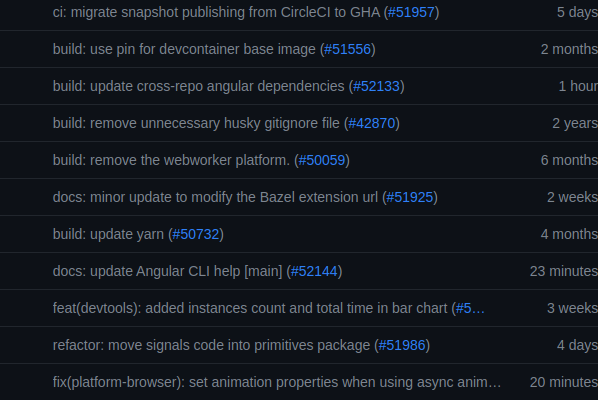

# 📏 CONVENÇÃO DE COMMITS


Quando usamos o git para versionar nossos projetos, é comum que façamos commits para salvar as alterações feitas no código.
Em cada commit é possível adicionar uma mensagem que descreve as alterações feitas naquele commit. Hoje nós vamos aprender como escrever uma boa mensagem de commit seguindo uma convenção.



## 🤔 Por que usar uma convenção?

Uma mensagem de commit deve ser escrita de forma clara e objetiva, de modo que qualquer pessoa que leia a mensagem consiga entender o que foi feito naquele commit. Utilizando uma convenção conseguimos padronizar as mensagens de commit e facilitar a leitura e interpretação das alterações feitas.

Esse cuidado especial pode parecer desnecessário, mas quando você precisar voltar em um commit antigo para corrigir um bug ou adicionar uma nova funcionalidade, você vai agradecer por ter escrito uma mensagem de commit clara e objetiva.

Um outro ponto positivo de usar mensagens padronizadas é que você pode usar ferramentas para interpretar essas mensagens e gerar um changelog automaticamente ou executar um script de deploy, por exemplo. Sem falar no fato de que seu histórico de commits vai ficar extremamente satisfatório de se ver.


## 📝 Convenção

> Obs: Não importa qual convenção você escolha, o importante é que você siga ela. A consistência é mais importante que a convenção em si. Se pelo menos o time todo seguir a mesma convenção, já é um grande passo. Se a empresa inteira seguir a mesma convenção, melhor ainda. Se o mundo inteiro seguir a mesma convenção, melhor ainda. Mas se você for o único a seguir a convenção, não vai adiantar nada.

A especificação para mensagem de commit mais popular que conheço é a [Conventional Commits](https://www.conventionalcommits.org/pt-br/v1.0.0).

A Conventional Commits é uma especificação que define um conjunto de regras para criar uma mensagem de commit. Nela você vai encontrar regras para definir o tipo, o escopo e a descrição de um commit, além do formato da mensagem em si.

Eu sigo uma convenção baseada na Conventional Commits, porém com algumas alterações que foram feitas para se adequar melhor ao dia a dia e gosto da equipe em que trabalho. Vamos ver como ela funciona.

### 📝 Formato

```text
<tipo>[escopo opcional]: <descrição>

[corpo opcional]

[rodapé(s) opcional(is)]
```

Esse formato é o padrão do Conventional Commits, neles temos:

- **Tipo** = O tipo é como um rótulo para a alteração feita naquele commit. Ele é obrigatório e deve ser um dos tipos pré-definidos. O tipo deve ser substantivo.
- **Escopo** = Um complemento a informação de tipo. Ele deve ser colocado entre parênteses e é opcional. O escopo deve ser um substantivo que descreve um pedaço da aplicação.

> Depois do tipo e escopo temos dois pontos e um espaço. Essa regra deve ser seguida mesmo que não tenha escopo. Se a alteração quebrar compatibilidade com versões anteriores, adicione um ponto de exclamação antes dos dois pontos.

- **Descrição** = Uma descrição de commit indica que alterações foram feitas. Ela é obrigatória e deve ser escrita no tempo verbal que representa o presente.
- **Corpo** = O corpo é opcional e deve ser usado para explicar o que foi feito e o porquê. Ele deve ser escrito no tempo verbal que representa o passado.
- **Rodapé** = O rodapé é opcional e deve ser usado para adicionar informações adicionais como links para issues, pull requests, etc.

> Entre a mensagem, o corpo e o rodapé deve haver uma linha em branco. Raramente o corpo e o rodapé são usados, então na maioria dos commits você vai escrever apenas a mensagem (pelo menos no meu caso).

Existem algumas outras regras na documentação original, mas essas são as que eu uso no meu dia a dia.

### 📝 Tipos

Os tipos principais são `feat` e `fix`. Eles são usados para indicar que você adicionou um novo recurso ou corrigiu um bug, respectivamente.

**Exemplos de mensagens de commit:**

```bash
git commit -m "feat!: passa a interpretar arquivos .json ao invés de .xml"
```

Na mensagem acima temos um commit do tipo `feat` com um ponto de exclamação antes dos dois pontos. Esse ponto de exclamação indica que a alteração quebrou compatibilidade com versões anteriores. A mensagem indica que agora o programa passa a interpretar arquivos `.json` ao invés de `.xml`.

```bash
git commit -m "fix(typo): adiciona pontuação correta"
```

Nessa mensagem temos um commit do tipo `fix` com o escopo `typo`. A mensagem e o escopo indicam que foi corrigido um erro de ortografia.

```bash
git commit -m "feat: adiciona função que encontra palavras duplicadas"
```

Nessa mensagem temos um commit do tipo `feat` sem escopo. A mensagem indica que foi adicionada uma função que encontra palavras duplicadas.

---

Além dos tipos principais, existem outros tipos que podem ser usados para indicar outros tipos de alterações. Muitas pessoas usam a [convenção do Angular](https://github.com/angular/angular/blob/main/CONTRIBUTING.md#commit), que define alguns tipos adicionais.

Os tipos definidos na convenção do angular são:

- build: Trata de mudanças no processo de build ou dependências externas.
- ci: Mudanças relacionadas a configuração de CI.
- docs: Mudanças que afetam apenas a documentação.
- feat: Adição de uma nova funcionalidade.
- fix: Correção de um bug.
- perf: Alterações que afetam a performance da aplicação.
- refactor: Uma mudança de código que nem adiciona uma funcionalidade e nem arruma um bug. Pode ser utilizado quando trocamos os nomes das variáveis de um método para algo mais semântico, por exemplo.
- test: Adição ou correção de testes.

Na versão que utilizo, eu adicionei alguns tipos adicionais que são usados com frequência na empresa em que trabalho e alterei alguns tipos para se adequarem melhor ao nosso dia a dia.

```diff
- - build: Trata de mudanças no processo de build ou dependências externas.
+ - build: Trata de mudanças no processo de build.
+ - deps: Trata de mudanças nas dependências externas.
```

Separamos o tipo `build` em dois tipos diferentes. O tipo `build` agora é usado apenas para mudanças no processo de build, como alterações no webpack, por exemplo. O tipo `deps` é usado para mudanças nas dependências externas, como atualização de versão do react ou PHP.

```diff
+ - format: Indica que a mudança é relacionada a formatação do código.
```

Adicionamos o tipo `format` para indicar que a mudança é relacionada a formatação do código. Esse tipo é usado quando formatamos o código com o prettier, eslint, etc.

Vamos ver alguns exemplos de mensagens de commit usando os tipos adicionais.

```bash
git commit -m "refactor: atribui números mágicos a constantes"
```

```bash
git commit -m "docs(dev): adiciona instruções para conexão com a API"
```

```bash
git commit -m "format: formata código com prettier"
```

```bash
git commit -m "deps: atualiza o react para a versão 18"
```

```bash
git commit -m "build: altera o caminho base do vite"
```

```bash
git commit -m "perf: redução da quantidade de requests feitas a cada minuto"
```

```bash
git commit -m "test: adiciona testes para o componente de FAQ"
```

```bash
git commit -m "fix: corrige problema com cors"
```

### Escopos

Os escopos são usados para complementar a informação de tipo. Eles devem ser um substantivo que descreve um pedaço da aplicação.

Os escopos são opcionais, então você pode escrever uma mensagem de commit sem escopo. Porém, se você escrever um escopo, ele deve ser escrito entre parênteses.

```bash
git commit -m "feat: adiciona função que encontra palavras duplicadas"
```

```bash
git commit -m "feat(FAQ): adiciona componente de FAQ"
```

## 🌳 Recomendações

- **Procure fazer commit de suas alterações de forma frequente.**

Evite acumular muitas alterações pois isso pode levar a confusão e dificuldade no momento de decidir o tipo, o escopo e até a mensagem do commit.

- **Commits não devem ser feitos de X em X horas, mas sim de X em X alterações.**

Você não deve pensar nos commits como uma tarefa que você faz uma vez ao dia, mas sim como uma tarefa que você faz a cada alteração significativa no código.

Essa mudança não se torna significativa por ter muitas linhas de código, mas sim por ter um significado. Por exemplo, se você adicionou uma nova funcionalidade, corrigiu um bug ou fez uma refatoração, você deve fazer um commit.

- **Quando fizer um commit, procure sempre selecionar as alterações com o menor número de dependências (`uso de código externo ao daquele arquivo`) possíveis.**

Isso vai facilitar na hora de fazer o merge, pois você vai ter menos conflitos para resolver.
