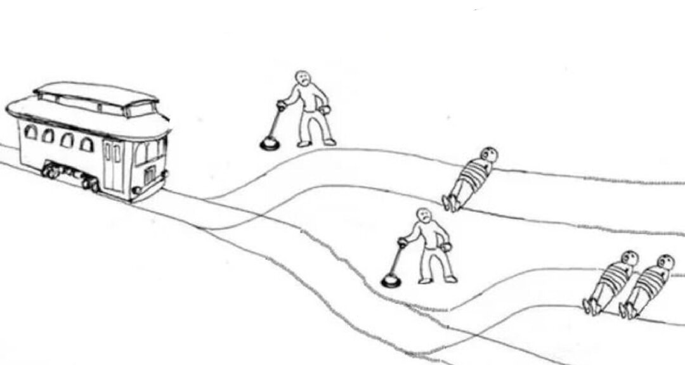
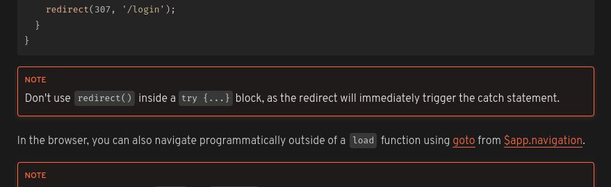

# Tratamento de Erros e Exceções no Javascript/TS


> Sim, essa imagem foi gerada por IA pois o autor é falido e não sabe desenhar.

Desenvolvedores Javascript (Typescript também) costumam ser muito otimistas. Não necessáriamente na vida, mas com código são. Muitos acreditam nas sucesso das funções com uma fé sobrehumana, especialmente funções que retornam promisses.

Aqui está um exemplo de como um desenvolvedor JS otimista faz uma chamada `fetch`:

```javascript
async function getSomeData() {
	const response = await fetch('/some-data');

	if (!response.ok) {
		return [];
	}

	return response.json();
}
```

Esse código é otimista demais, considera que nada pode dar errado e portanto não trata absolutamente nenhum erro.

Vamos pensar no que pode dar errado nesse código:

- A requisição pode falhar por um erro de rede e lançar uma exceção
- O payload da resposta pode não ser um JSON válido e o `response.json()` vai lançar uma exceção
- O payload pode ser um JSON válido, mas não ter o tipo esperado

Aqui está uma versão mais realista do código acima:

```javascript
async function getSomeData() {
	try {
		const response = await fetch('/some-data');

		if (!response.ok) {
			return [];
		}

		const data = await response.json();

		if (!Array.isArray(data)) {
			return [];
		}

		return data;
	} catch (error) {
		return [];
	}
}
```

Agora sim, o código trata alguns possíveis casos de erro e não vai quebrar a aplicação.

Ainda temos alguns problemas:

- Fazemos o uso de um anti-pattern conhecido como `try, catch e cala boca`, um bloco de código que ao se deparar com um problema silencia o erro e continua a execução do código.
- Validamos apenas se o retorno realmente foi um array, mas a validação parou por aí

Se algo der errado, o código vai continuar a execução como se nada tivesse acontecido e sem que ninguém seja informado que algo deu errado.


Vamos alterar o código acima mantendo a mesma lógica, mas sem usar o `try, catch e cala boca`:

> No nosso código você já deve ter percebido que estamos sempre retornando um array vazio quando algo dá errado. Isso é uma decisão de design. Em alguns casos, retornar um valor padrão é uma boa ideia. Em outros casos, pode ser melhor lançar uma nova exceção ou retornar um valor de erro. Isso depende do contexto. O importante é que o código trate os casos de erro.

```javascript
// logger.js
function logError(error) {
	console.error(error); // Substitua isso por uma ferramenta de log real, como sentry ou semelhante
}

// api.js
import { logError } from './logger.js';

async function getSomeData() {
	try {
		const response = await fetch('/some-data');

		if (!response.ok) {
			logError(new Error('Request failed'));
			return [];
		}

		const data = await response.json();

		if (!Array.isArray(data)) {
			logError(new Error('Invalid response'));
			return [];
		}

		return data;
	} catch (error) {
		logError(error instanceof Error ? error : new Error(`Unknown error: ${String(error)}`));
		return [];
	}
}
```

O código retorna um array vazio quando algo dá errado e registra os erros no logger.

Optamos por uma abordagem mais defensiva. Apesar de ter mais linhas que o original, o código é mais seguro. Sei que executar mais instruções geralmente reduz a velocidade, mas isso não é um problema tão grande no nosso caso e um programa que rode sem interrupções como um _crash_ é mais agradável de usar do que um que fracassa na velocidade da luz.

Talvez você possa confiar na API que você está consultando e remover algumas checagens, mas isso é uma decisão sua que varia de projeto em projeto.


Em alguns outros casos talvez você queira passar o erro adiante, encerrar a execução do código ou mostrar uma mensagem de erro para o usuário.

Se esse é o seu desejo, Você pode usar a palavra reservada `throw` para lançar uma exceção. Quando você lança uma exceção, o código para de executar e o erro é passado adiante.

```javascript
async function getSomeData() {
	const response = await fetch('/some-data');

	if (!response.ok) {
		throw new Error('Request failed');
	}

	const data = await response.json();

	if (!Array.isArray(data)) {
		throw new Error('Invalid response');
	}

	return data;
}
```

Essa é uma política meio `dobro e passo pro próximo`. O código que chama a função `getSomeData` é responsável por tratar a exceção.



Nem o Javascript, nem o Typescript tem mecanismos na linguagem que te permitam restringir que tipo de exceção você pode lançar então é sempre uma boa ideia checar o tipo do que você recebeu no bloco `catch`.

Isso pode te levar a:

- Tratar exceções que nunca vão acontecer
- Não tratar exceções que podem acontecer

Uma solução para esse problema é usar comentários JSDoc. O JSDoc é um formato de comentário que você pode usar para documentar funções, variáveis, etc. O Typescript é capaz de usar o JSDoc para inferir tipos de variáveis e funções em codebases Javascript.

```javascript
/**
 * @throws {TypeError} - Se houver um erro de rede
 * @throws {Error} - Se o response não for ok ou se o status não for 200
 * @throws {SyntaxError} - Se a resposta não for um JSON válido
 * @throws {Error} - Se a resposta não for um array
 * @returns {Promise<Array>}
 */
async function getSomeData() {
	const response = await fetch('/some-data');

	if (!response.ok) {
		throw new Error('Request failed');
	}

	const data = await response.json();

	if (!Array.isArray(data)) {
		throw new Error('Invalid response');
	}

	return data;
}
```

Isso é bom o suficiente? Não. Isso é uma solução paliativa. O JSDoc não é uma ferramenta que te avisa que você precisa tratar uma exceção ela só deixa aí pra quem quiser ver que a função pode lançar uma exceção. Se você não ler o pau vai comer e é isso aí.

Como comentei antes, no Javascript/Typescript você pode lançar qualquer coisa como exceção. Você pode lançar um número, uma string, um objeto, o que vier na sua cabeça. Isso é até usado por frameworks famosos como o [SvelteKit](https://kit.svelte.dev/docs) para [lançar um redirect](https://kit.svelte.dev/docs/load#redirects) usando `throw` e encerrar a execução do código daquele ponto em diante enquanto o próprio framework trata essa _"exceção"_ e faz o redirecionamento.



Por isso que nós geralmente temos que encher os blocos `catch` de `if (error instanceof SomeErrorClass) { ... }` para saber que tipo de erro estamos tratando. Existe até uma proposta no TC39 chamada [ECMAScript Catch Guards](https://github.com/wmsbill/proposal-catch-guards) que visa resolver esse problema mas não acredito que vai rolar tão cedo.

> A proposta esta em estágio 0 então melhor não contar com ela.

Linguagens como o Java que te obrigam a tratar as exceções ou lançar elas adiante, deixando claro na assinatura da função. Go te faz tratar o erro como um valor e você tem que ficar checando a cada ponto que dá erro. Isso é uma feature da linguagem. O Javascript/Typescript não tem isso. Você pode lançar uma exceção e não tratar ela.

Alguns até diriam que isso é um feature do JS/TS, afinal dá para ir bem rápido se você ignorar todos os sinais de transito e não parar nos sinais vermelhos.


Existe um jeito de mudar isso, mas a partir de agora os exemplos serão apenas em Typescript. Podemos passar o erro adiante como um `Result`, `Either` ou `Optional` e forçar quem chama a função a tratar o erro para obter o valor. Essa é uma feature comum de linguagens de programação funcionais e não existe por padrão no Javascript/Typescript, mas você pode implementar isso.

```javascript
type Ok<T> = {
	readonly status: 'ok';
	readonly value: T;
};

type Fail = {
	readonly status: 'fail';
	readonly message: string;
};

type Result<T> = Ok<T> | Fail;

function ok<T>(value: T): Ok<T> {
	return { status: 'ok', value };
}

function fail(message: string): Fail {
	return { status: 'fail', message };
}

export function isFail<T>(result: Result<T>): result is Fail {
	return result.status === 'fail';
}

export function isOk<T>(result: Result<T>): result is Ok {
	return result.status === 'ok';
}

export async function wrapAsync<T>(promise: Promise<T>): Promise<Result<T>> {
	try {
		const value = await promise;
		return ok(value);
	} catch (error) {
		const message = error instanceof Error ? error.message : String(error);
		return fail(message);
	}
}

export function wrapSync<T>(fn: () => T): Result<T> {
	try {
		const value = fn();
		return ok(value);
	} catch (error) {
		const message = error instanceof Error ? error.message : String(error);
		return fail(message);
	}
}
```

O código refatorado seria mais ou menos assim:

```ts
async function getSomeData(): Result<unknown[]> {
	const resResult = await wrapAsync(fetch('/some-data'));

	if (isFail(resResult)) return resResult;

	if (!resResult.value.ok) return fail('Request failed');

	const dataResult = await wrapAsync(response.json());

	if (isFail(dataResult)) return dataResult;

	if (!Array.isArray(dataResult.value)) return fail('Invalid response');

	return dataResult;
}
```

Agora quem chama a função `getSomeData` é obrigado a tratar o erro para obter o valor, assim como fomos obrigados a tratar os retornos de `wrapAsync`.

Essa prática pode ser reforçada pelo seu linter caso esteja trabalhando em um projeto com mais pessoas.

## Mais algumas coisas...

- Se você está lidando com `promises`, fique atento, promessas podem ser rejeitadas e você tem que tratar isso.
- Trate exceções globais, é importante.
- Se você está usando algo como `React` dê uma olhada no conceito de [`Error Boundaries`](https://react.dev/reference/react/Component#catching-rendering-errors-with-an-error-boundary) para lidar com erros de renderização.
- Se você está usando `Node.js`, dê uma olhada nos eventos como [`uncaughtException` e `unhandledRejection`](https://nodejs.org/api/process.html#warning-using-uncaughtexception-correctly) para lidar com erros não tratados.
- Explore soluções como [`Result` e `Either`](https://blog.rockthejvm.com/functional-error-handling-in-kotlin-part-2/) para ter uma experiência mais clara.
- Documente suas funções com [JSDoc para deixar claro que uma função pode lançar uma exceção](https://jsdoc.app/tags-throws).
- Reporte erros para o usuário de forma clara e objetiva.
- Reporte erros para o seu logger para que você possa investigar o que deu errado. Monitorar erros é importante.
- Usando [tanstack query v5](https://tanstack.com/query/latest) você pode usar o `onError` para tratar erros de promises.
- No [Next.js v14](https://nextjs.org/docs/app/building-your-application/routing/error-handling) você pode usar o arquivo `error.tsx` para tratar erros.
- No [SvelteKit v2](https://kit.svelte.dev/docs/routing#error) você pode fazer algo bem parecido com o Next.js usando o `+error.svelte`.

```txt
Porque a confiança é uma mulher ingrata
Que te beija e te abraça, te rouba e te mata

- Desenvolvedor Javascript as sete da noite subindo uma correção para um erro que ele não tratou.
```
