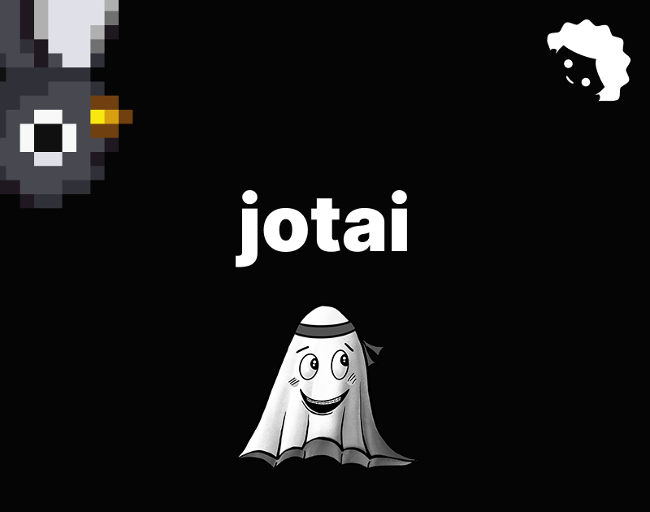

# Jotai



[Jotai](https://jotai.org/) é como aquela lib do Facebook para gerenciar estados que se chamava [Recoil](https://recoiljs.org/).

Objetivo: Gerenciar estado global de forma fácil e atômica, bloquinho por bloquinho.

Os principais conceitos no Jotai são os átomos (`atoms`), que são pequenos pedaços de estado que você define com a função `atom`

```ts
import { atom } from 'jotai';

const countAtom = atom(0);

const citiesAtom = atom(['Barreiras - BA', 'Morpará - BA', 'Pintópolis - MG']);
```

Você pode definir átomos para todo tipo de coisa, várias estruturas de dados como mapas e sets também contam.

Você pode derivar o estado de um átomo criando outro e usando a função `get` passada como parâmetro para a função `atom` para _escutar_ as alterações que acontecem com um determinado átomo.

```ts
const bahiaCitiesAtom = atom((get) => {
  const cities = get(citiesAtom)
  return cities.filter((item) => item.includes(' - BA')
})
```

Essas variáveis podem ser definidas em qualquer arquivo TS comum e para usá-los no React a gente usa um hook chamado `useAtom`:

```tsx
import { useAtom } from 'jotai'

import { citiesAtom } from './atoms'

const CitiesApp = () => {

  const [cities, setCities] = useAtom(citiesAtom)

  return (
    <>
      <ul>
        {cities.map((item) => (
          <li key={item}>{item}</li>
        ))}
      </ul>

      <button onClick={() => {
        setCities((cities) => cities.toReversed())
      }}>
		Inverter
      </button>
    <>
  )
}
```

Se quiser apenas um getter ou só o setter você pode usar os hooks dedicados `useAtomValue` para leitura e `useSetAtom` para escrita!

No [[NextJS]] você vai importar o `Provider` do Jotai e usar no seu `layout.tsx` principal puxando ele de um componente com `'use client'` no topo.

```tsx
// ./app/providers.tsx

'use client';

import { Provider } from 'jotai';

export const Providers = ({ children }: { children: React.ReactNode }) => {
	return <Provider>{children}</Provider>;
};

// ./app/layout.tsx
import { Providers } from '../components/providers';

export default function RootLayout({ children }: { children: React.ReactNode }) {
	return (
		<html lang="pt-BR">
			<body>
				<Providers>{children}</Providers>
			</body>
		</html>
	);
}
```

Você tem acesso a algumas outras funções de utilidade para enriquecer o seu código como `atomWithStorage` para definir um átomo que é persistido no `window.localStorage`.

Você tem acesso a essas funções no namespace `jotai/utils`.

Você também pode usar extensões com o Jotai já integrado a coisas como o Immer ou tRPC.

> Estados atômicos globais parecem com variáveis globais e isso não é atoa, no fim das contas é basicamente isso mesmo.
