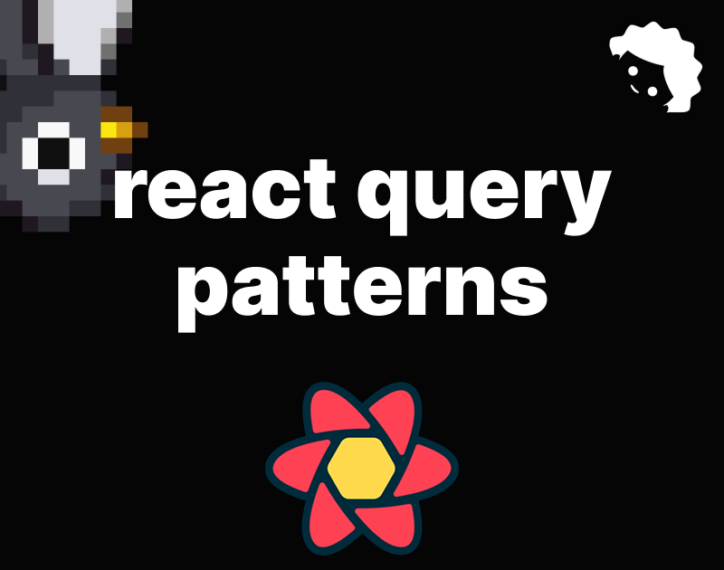

## Definir uma queryFn



A _minha preferência pessoal_ e recomendação é que você sempre separe código que é simplesmente Typescript de código que tá engrenhado no ciclo de vida do react e/ou outras bibliotecas.
Para requests recomendo que você sempre dê preferência a criar as funções que fazem as chamadas separadamente caso esse código não seja gerado automágicamente.

```ts
import { User } from './type';

const API_URL = 'https://api.example.com';

export type GetUserParams = Pick<User, 'id'>;

export async function getUserById(params: GetUserParams): Promise<User> {
	const url = new URL('/user/', API_URL);
	url.searchParams.set('id', params.id);

	const response = await fetch(url);

	if (!response.ok) throw new Error('failed request');

	return response.json();
}
```

> !tip
> O JSON retornado está sendo tratado como User, mas não é garantido que o JSON retornado seja sempre um User.
> Se o JSON retornado não for um User, o código vai quebrar.
> Só faça isso se você tem 100% de certeza que o JSON retornado será sempre um User.
> Se não tiver 100% de certeza, use a abordagem de "type assertion" ou "type guard".

Vamos ver um exemplo para uma requisição PUT:

```ts
import { User } from './type';

const API_URL = 'https://api.example.com';

export type UpdateUserParams = Pick<User, 'id'> & Partial<User>;

export async function updateUser({ id, ...body }: UpdateUserParams): Promise<User> {
	const url = new URL('/user/' + id, API_URL);

	const response = await fetch(url, {
		method: 'PUT',
		body: JSON.stringify(body)
	});

	if (!response.ok) throw new Error('failed request');

	return response.json();
}
```

## Definir uma query

Existem N formas de definir queries, o recomendado pelo pessoal do Tanstack é usando `queryOptions`.
Usando queryOptions ganhamos mais segurança com os tipos, isso dá uma vantagem grande em relação a outras opções como queryKeyFactories e soluções alternativas.

```ts
import { queryOptions } from '@tanstack/react-query';
import { getUserById, type GetUserParams } from './get';

export function getUserByIdQueryOptions(params: GetUserParams) {
	return queryOptions({
		queryKey: ['user', params.id],
		queryFn: () => getUserById(params)
	});
}
```

Para usar essas query options geradas pela função `getUserByIdQueryOptions` você pode passar seu conteúdo diretamente para o `useQuery`

```ts
import { useQuery } from '@tanstack/react-query';
import type { GetUserParams } from './get';
import { getUserByIdQueryOptions } from './query-options';

export function PageComponent({ params }: { params: { id: string } }) {
	const query = useQuery(getUserByIdQueryOptions(params));

	if (query.isLoading) {
		return <LoadingComponent/>;
	}

	if (query.error) {
		return <ErrorComponent error={query.error} />;
	}

	if (typeof query.data === 'undefined') {
		return <NotFoundComponent/>;
	}

	return <UserComponent user={query.data} />
}
```

Você também pode definir um hook, caso queira algo mais curto para usar por aí:

```ts
import { useQuery } from '@tanstack/react-query';
import type { GetUserParams } from './get';
import { getUserByIdQueryOptions } from './query-options';

export function useGetUserByIdQuery(params: GetUserParams) {
	return useQuery(getUserByIdQueryOptions(params));
}
```

Isso pode não parecer muito útil agora, mas quando temos que invalidar queries e fazer optimistic updates isso ajuda muito. Vamos ver outros exemplos adiante.

## Definir uma mutation

Para mutations podemos usar `mutationOptions` e definir as coisas de forma semelhante. Pessoalmente eu não acho que seja necessário na maior parte dos casos, mas caso queira usar hooks como `useMutationState` e `useIsMutating` você precisa definir uma `mutationKey` então a função `mutationOptions` se torna tão útil quanto `queryOptions`.

```ts
import { mutationOptions } from '@tanstack/react-query';
import { updateUser } from './put';

export function postUserByIdMutationOptions() {
	return mutationOptions({
		mutationKey: ['user'],
		mutationFn: updateUser
	});
}
```

## Transformar dados da response em queries

Quando precisamos transformar um dado que veio da API é comum alterar completamente o retorno da queryFn ou ter um código adicional que trata `query.data`. Essas soluções fazem sentido, mas o react-query oferece uma forma bem interessante e performática de fazer essas operações: [funções select](https://tanstack.com/query/latest/docs/framework/react/guides/render-optimizations#select)

```ts
import { useQuery } from '@tanstack/react-query';
import type { GetUserParams } from './get';
import { getUserByIdQueryOptions } from './query-options';
import type { User } from './type';

function selectUserWithFullName(user: User) {
	return {
		...user,
		fullName: `${user.firstName} ${user.lastName}`
	};
}

export function useGetUserWithFullNameByIdQuery(params: GetUserParams) {
	return useQuery({
		...getUserByIdQueryOptions(params),
		select: selectUserWithFullName
	});
}
```

Com isso nossa função que faz a transformação dos dados pode ser pura e fácil de testar, caso seja necessário.

## Atualizar um dado e invalidar uma query

Toda aplicação tem um CRUD dentro de si. A operação de leitura é feita pelas nossas queries e as demais pelas nossas mutations.
Quando fazemos uma mutation é comum querer que o dado alterado por ela seja buscado novamente ou atualizado diretamente, para fazer isso nós usamos o `queryClient` e chamamos o método `invalidateQueries` passando um objeto com a `queryKey` ou outra forma de identificar a query que vai ter seu cache invalidado, causando um novo request para buscar a versão atualizada.

Um erro comum é usar a queryKey errada e o dado não ser atualizado quando deveria ou uma queryKey muito genérica e acidentalmente invalidar mais coisas do que é necessário.

Usando `queryOptions` nós evitamos esse problema! A queryKey é definida somente nessa função, evitando erros.

```ts
import { useMutation, useQueryClient } from '@tanstack/react-query';
import { postUserByIdMutationOptions } from './mutation-options';
import { getUserByIdQueryOptions } from './query-options';

export function useUpdateUserMutation() {
	const queryClient = useQueryClient();

	return useMutation({
		...postUserByIdMutationOptions(),
		onSuccess: (data) => {
			const query = getUserByIdQueryOptions(data);
			queryClient.invalidateQueries(query);
		}
	});
}
```

> !tip
> O queryKey é gerado a partir do id do usuário. Se o id do usuário mudar, o queryKey também mudará e a query será invalidada. Se o id do usuário não mudar, a query não será invalidada.

### Quero que o update seja imediato (Optimistic Update)

Nesses casos ter um `queryOptions` é ainda mais útil, nos dá muita precisão!

```ts
import { useMutation, useQueryClient } from '@tanstack/react-query';
import { postUserByIdMutationOptions } from './mutation-options';
import { getUserByIdQueryOptions } from './query-options';

export function useUpdateUserMutation() {
	const queryClient = useQueryClient();

	return useMutation({
		...postUserByIdMutationOptions(),
		onMutate: async (updatedUser) => {
			const query = getUserByIdQueryOptions(updatedUser);

			/**
			 * Cancelamos as queries que estão sendo feitas para o usuário.
			 * Isso é importante para evitar que as queries sejam sobrescritas pela nossa atualização otimista.
			 */
			await queryClient.cancelQueries(query);

			/**
			 * Pegamos o valor anterior do usuário.
			 */
			const previousUser = queryClient.getQueryData(query.queryKey);

			/**
			 * Atualizamos o valor do usuário com o novo valor.
			 */
			queryClient.setQueryData(query.queryKey, (old) => ({
				...old,
				...updatedUser
			}));

			return { previousUser };
		},
		/**
		 * Se a mutação falhar, usamos o contexto retornado de onMutate para desfazer a atualização otimista.
		 */
		onError: (_err, updatedUser, context) => {
			const query = getUserByIdQueryOptions(updatedUser);
			queryClient.setQueryData(query.queryKey, context.previousUser);
		},
		/**
		 * Sempre invalidamos as queries após erro ou sucesso:
		 */
		onSettled: (_data, _err, updatedUser) => {
			const query = getUserByIdQueryOptions(updatedUser);
			queryClient.invalidateQueries(query);
		}
	});
}
```

## Checar se uma query ou mutation está carregando sem acesso direto

Se, por exemplo, eu quiser mostrar uma barrinha de carregamento no topo da página toda vez que um recurso for atualizado via uma mutation eu posso usar os hooks `useMutationState` e `useIsMutating` para checar se ela tá pendente ou não. Posso fazer a mesma coisa com as queries, basta usar `useQueryState` e `useIsFetching`.

Os hooks `useIsMutating` e `useIsFetching` retornam uma contagem de quantas mutations/queries estão sendo buscadas no momento.

```ts
import { useIsFetching, useIsMutating, useMutation } from '@tanstack/react-query';
import { postUserByIdMutationOptions } from './mutation-options';
import { useGetUserByIdQuery } from './query';

const mutation = useMutation(postUserByIdMutationOptions());

mutation.mutate({ id: 1, name: 'John Doe' });
mutation.mutate({ id: 2, name: 'Jane Doe' });
mutation.mutate({ id: 3, name: 'John Smith' });

/**
 * 3 mutations estão sendo feitas para o usuário.
 */
const isMutatingUsersCount = useIsMutating(postUserByIdMutationOptions());

useGetUserByIdQuery({ id: 1 });
useGetPostsFromUserQuery({ id: 1 });

/**
 * 2 queries estão sendo feitas.
 */
const isFetchingCount = useIsFetching();
```

A partir daí podemos checar se `isFetchingCount` é maior que zero e fazer algo em relação a isso.
