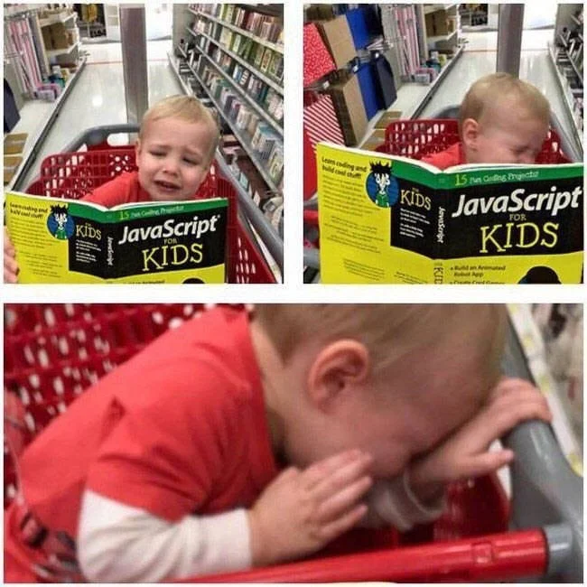

# Um pontapé inicial no desenvolvimento frontend web

```js
console.log('Olá mãe!');
```

Esse texto possui links de ajuda, conteúdo gratuito, dicas, resumos beeeeeem resumidos e minhas opiniões individuais.



Eu comecei de forma meio torta no desenvolvimento no geral, mas se eu fosse estudar do zero hoje eu seguiria algo mais ou menos [assim](https://roadmap.sh/frontend) mas com algumas alterações.

_Quando eu comecei a primeira coisa que eu fiz foi ver o precisava para estudar._

O bom da web é que você pode começar com pouco, um PC que te permita abrir umas três abas no navegador é o suficiente para **começar**.

Pensei também sobre cursos e lugares para aprender. Minha recomendação são esses aqui:

- [RoadMap.sh](https://roadmap.sh/frontend)

Um rumo para estudar.

- [MDN - Mozilla Developer Network](https://developer.mozilla.org/pt-BR/docs/Learn)

A Mozilla, responsável pelo Firefox tem essa maravilha aí. Documentação legal, exemplos, tutoriais, guias, dicas, um monte de coisa boa.

- [W3CSchools - Word Wide Web Consortium](https://www.w3schools.com/)

A W3C é responsável por muita coisa da WEB e foi criada pelo pai da internet, o Tim Berners-Lee. A School tem bastante conteúdo para aprender a criar seus primeiro sites.

- [FreeCodeCamp](https://www.freecodecamp.org/learn)

Conteúdo, exercícios e desafios para aprender HTML, CSS, Javascript e mais um monte de coisa.

- [Javascript30](https://javascript30.com/)

Muitos projetinhos para treinar

- [Canal do Roger Melo](https://www.youtube.com/c/RogerMelo)

O homem ensina a fazer as coisas na mão.

- [Rocketseat - Discover](https://www.rocketseat.com.br/discover)

A Rocketseat tem muito conteúdo legal e o Maik Brito é um cara massa. Dá para aprender várias coisas base na trilha discover (que é de graça).

- [Código Fonte TV - Dicionário do programador](https://www.youtube.com/watch?v=hwttZtWkXTk)

Mais de 100 vídeos falando sobre coisas do mundo da programação. Isso vai te ajudar a não ficar tão perdido quando ouvir as sopa de letrinhas que aparece na área.

- [Canal do Dev Soutinho](https://www.youtube.com/c/DevSoutinho)

O menino entende de Javascript e compartilha conhecimento.

- [Podcast do Hipsters](https://www.hipsters.tech/)
- [Podcast da Lambda3](https://podcasts.google.com/feed/aHR0cDovL2Jsb2cubGFtYmRhMy5jb20uYnIvZmVlZC9wb2RjYXN0Lw?sa=X&ved=0CAMQ4aUDahcKEwjImvG1x5r5AhUAAAAAHQAAAAAQAQ)
- [Podcast dos Devs Cansados](https://podcasts.google.com/feed/aHR0cHM6Ly9hbmNob3IuZm0vcy9jOTQ2YzIwL3BvZGNhc3QvcnNz?sa=X&ved=0CAMQ4aUDahcKEwiA85ewx5r5AhUAAAAAHQAAAAAQAQ)
- [Podcast do Dev Na Estrada](https://podcasts.google.com/feed/aHR0cHM6Ly9kZXZuYWVzdHJhZGEuY29tLmJyL2ZlZWQueG1s)

Para absolver mais conhecimento enquanto espera o ônibus que atrasou.

- **Tem mais um bocado de coisa boa por aí no YouTube. Minha dica é que você tente praticar o que aprender, não importa com o que seja. Escreva código. Não caia na armadilha dos tutoriais.**

## Como eu aprenderia + resuminhos para saber se você está pesquisando a coisa certa

Eu começaria tentando entender um pouco da base de como funciona a internet. _Os conceitos são bem úteis quando você vai avançando, mas não precisa se preocupar em aprender tudo nos mínimos detalhes, você vai ter tempo pra ir revisando depois._

### Como funciona a internet ?

> Resumo: Computadores mandando informação uns para os outros. Eles fazem isso usando um identificador único (pique CPF) o IP para saber quem é quem na conversa.

Seres humanos não lembram de números com facilidade então a gente inventou um jeito de usar palavras conhecidas como nomes de domínio (DNS - Sistema de nome de domínio).

Desse jeito ao invés de acessar [142.251.129.206](142.251.129.206) (Joga no navegador) a gente acessa [https://google.com](https://google.com).

#### Links

- [Como funciona a internet - MDN](https://developer.mozilla.org/pt-BR/docs/Learn/Common_questions/How_does_the_Internet_work)

- [Como funciona a internet? Part : O protocolo IP](https://www.youtube.com/watch?v=HNQD0qJ0TC4)

- [Como funciona a Internet? Parte 3: DNS](https://www.youtube.com/watch?v=ACGuo26MswI)

### O que compõem um site?

> Resumo: HTML, CSS e Javascript.

Onde o HTML provê estrutura para o conteúdo, o CSS a aparência e o Javascript a interatividade.

_Uma máquina não sabe dizer o que é um parágrafo e o que é um título então você usa símbolos para dizer oque é cada coisa_:

```html
<section>
  <h1>Titulo</h1>
  <p>Meu lindo parágrafo</p>
  
</section>
```

_As coisas agora fazem sentido, mas 1998 ficou para trás então a gente pode deixar tudo mais interessante com CSS (Folha de estilos em cascata)_:

```css
body {
  background-color: antiquewhite;
}

section {
  width: fit-content;
  padding: 1rem;
  border-radius: 1rem;
  background-color: white;
  box-shadow: 0.1rem 0.1rem 0.1rem hsla(0 0 0 / 50%);
}

h1 {
  font-family: 'Poppins';
  font-size: 3rem;
  font-weight: 800;
  color: black;
}

p {
  font-weight: 500;
  color: gray;
}

img {
  width: 5rem;
  border-radius: 0.5rem;
}
```


_E com Javascript a gente pode fazer as coisas acontecerem_:

```js
const gatinho = document.querySelector('img');
gatinho.addEventListener('click', () => alert('Cliquei num gatinho'));
```

Nessa época aprendi também que **Javascript não é Java e não tem nada a ver com Java**. Javascript só tem esse nome por conta de uma estratégia de marketing, seu nome real é EcmaScript e sua versão depende do ano, estamos no ES2022.

#### Links

- [Introdução à Web - MDN](https://developer.mozilla.org/pt-BR/docs/Learn/Getting_started_with_the_web)

### Cliente vs Servidor

> Resumo: Cliente quem envia o recurso, cliente é quem pede e consome.

Para que os dois lados se entendam eles usam tem que se comunicar com algumas regras, essas regras são chamadas de protocolos.

O mais comum na web é o HTTP.

#### Links

- [Cliente e servidor - MDN](https://developer.mozilla.org/pt-BR/docs/Learn/Server-side/First_steps/Client-Server_overview)

- [Conceito cliente-servidor](https://conceito.de/cliente-servidor)

### O que é o protocolo HTTP?

> Resumo: Hypertext Transfer Protocol. É um protocolo que permite a obtenção de recursos como imagens, HTML, CSS, Javascript, texto e qualquer outra coisa na verdade.

#### Links

- [Uma visão geral do HTTP](https://developer.mozilla.org/pt-BR/docs/Web/HTTP/Overview)
- [Entenda o que é HTTP](https://rockcontent.com/br/blog/http/)

### Aprender HTML

Nessa parte do HTML eu focaria em aprender a ideia geral e em entender a semântica das coisas. HTML é semântica, é dar significado as coisas, estrutura.

> Aprenda sobre:

- O básico
- Elementos inline vs Elementos block
- Formulários
- Validações de formulários no HTML
- Convenções e boas práticas
- HTML semântico

Crie uns layouts pelo caminho, pense em como organizar o conteúdo de um site, monte coisas.

Depois disso tente entender um pouco sobre acessibilidade e como isso pode afetar o seu site (Resumo: O robô do google que procura seu site é cego, se seu site não tem nada com nada como ele vai achar as coisas que importam... e além disso você não quer ser a pessoa faz mal a pessoas com necessidades específicas).

### Aprender CSS

Esse pode ser ou muito divertido ou muito infernal. Você vai ir aprendendo um pouco de CSS junto com HTML e vai se tornar cada vez melhor nisso com o tempo.

> Aprenda sobre:

- O básico
- O que são os seletores CSS (Recomendo usar classes em 99% das situações)
- Como separar o CSS do seu HTML
- Box Model
- CSS Flex Box
- Como criar layouts
- Responsividade (Como fazer seu site ficar bonito em vários tamanhos de telas)
- CSS Grid

Depois você pode ir se aperfeiçoando e pode tirar um tempo para aprender sobre convenções de nomes de classes e tudo mais.

### Aprendendo Javascript

É aqui onde você vai gastar mais tempo. Javascript é uma linguagem de programação bem legal e com muitas possibilidades.

- Javascript roda no seu navegador web. Você pode abrir seu computador, apertar F12 e começar a programar JS.

- É possível escrever frontend web (sites, web apps e coisa do tipo) com Javascript
- É possível escrever frontend mobile (aplicativos Android e IOS) com Javascript
- É possível escrever frontend desktop (aplicativos Windows, Linus e OSX) com Javascript
- É possível escrever backend (aplicações de servidor, aplicações em tempo real, serviços em geral) com Javascript
- É possível fazer maconha com maisena e Javascript


> Aprenda sobre:

- Sintaxe básica e lógica
- Entenda os conceitos de hoisting, escopo e etc.
- Diferença entre const, let e var
- Manipulação do DOM
- Aprenda sobre eventos
- Aprenda a usar o FETCH
- Aprenda recursos do ES6 e Javascript modular
- Pesquise sobre o que é programação funcional
- Aprenda a usar o map, filter e reduce
- Aprenda a usar async / await e como funciona Javascript assíncrono

Crie projetos... muitos.

#### Links

- [FreeCodeCamp](https://www.freecodecamp.org/learn/javascript-algorithms-and-data-structures/)

_Em breve eu faço mais coisas sobre os próximos passos no desenvolvimento web, como gerenciamento de versões com git, onde guardar seu código e subir seus primeiros sites (github), o básico de segurança na web, sobre como organizar projetos simples e médios, que framework usar, como aprender com código alheio e etc._
