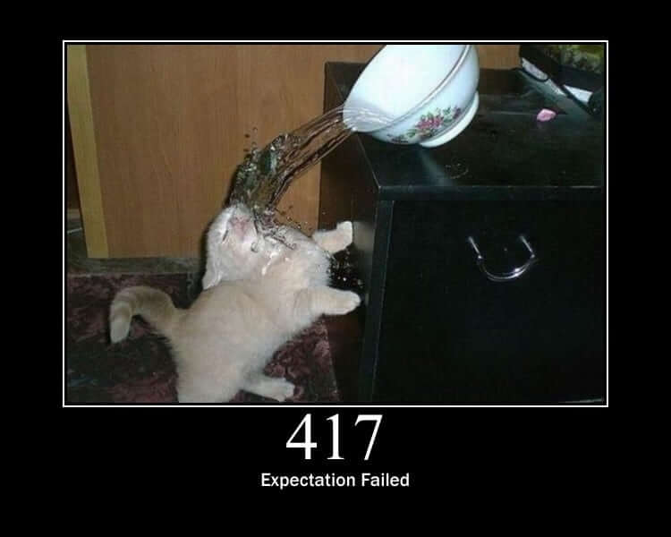
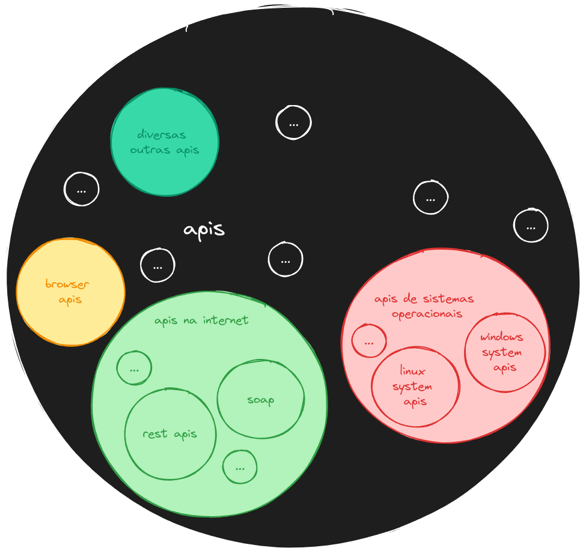
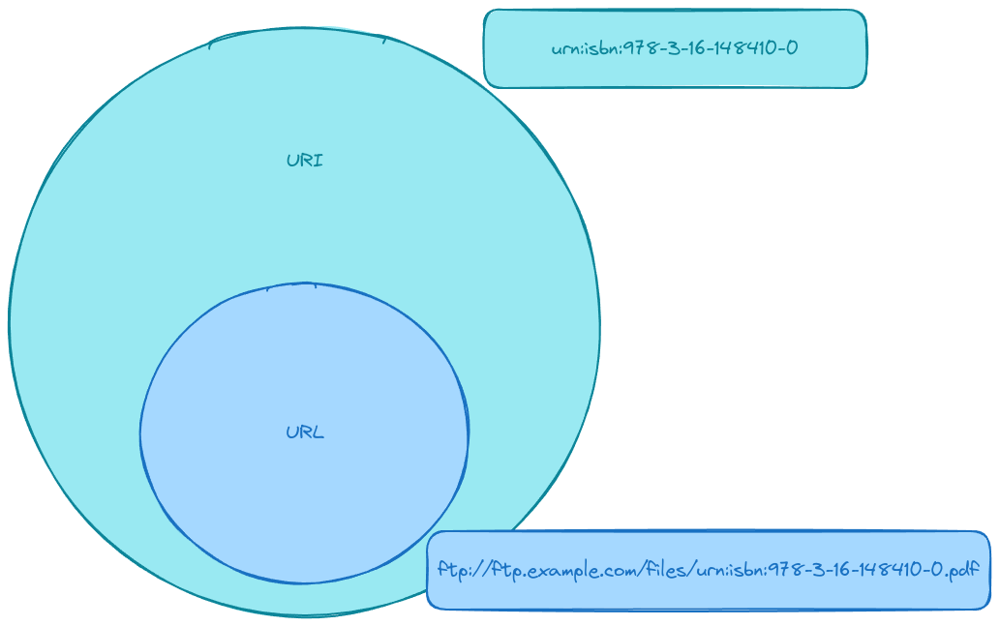
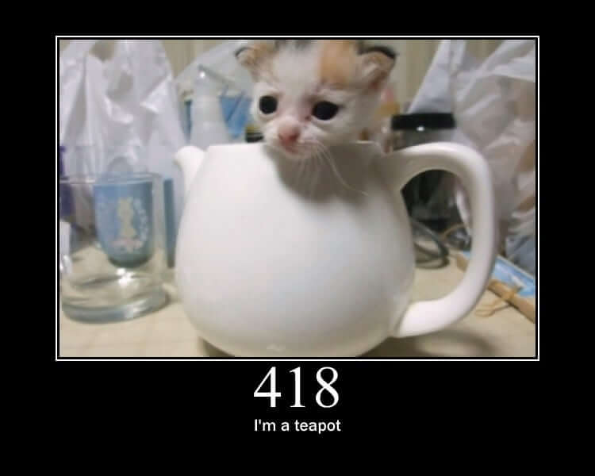

## Conceitos básicos



### Arquitetura cliente-servidor

A arquitetura cliente-servidor é um modelo de computação distribuída que separa as funções de cliente e servidor. O cliente solicita serviços que são fornecidos pelo servidor. A comunicação entre cliente e servidor ocorre através de uma rede de computadores.

### API

Uma API (Application Programming Interface) é um conjunto de regras e padrões que define como um software deve interagir com outro. Ela permite que diferentes sistemas se comuniquem entre si, permitindo que um sistema acesse os recursos de outro sistema de forma padronizada.

São exemplos de APIs: APIs de banco de dados, APIs de sistema operacional, APIs de bibliotecas de programação, APIs de serviços web, entre outros.



Aqui estarei falando sobre APIs de serviços web, que são APIs que permitem que aplicativos se comuniquem através da internet. **Daqui em diante, quando eu falar de API, estarei me referindo a APIs de serviços web.**

### REST

REST (Representational State Transfer) é um estilo arquitetural que define um conjunto de princípios para projetar serviços web. Ele é baseado em recursos, que são identificados por URLs, e usa métodos HTTP para realizar operações sobre esses recursos.

### Protocolo HTTP

O protocolo HTTP (Hypertext Transfer Protocol) é um protocolo de comunicação utilizado para transferir informações na World Wide Web. Ele é baseado no modelo cliente-servidor, onde o cliente envia uma requisição ao servidor e o servidor responde com uma mensagem contendo o recurso solicitado.

Temos diversas versões do protocolo HTTP, sendo as mais comuns a HTTP/1.1 e a HTTP/2, e a mais recente a HTTP/3.

A versão 1.1 é muito utilizada e é fácil de entender, até para nós humanos.

### Requisição e resposta HTTP

Exemplo de mensagem de requisição:

```http
POST /users HTTP/1.1
Host: api.example.com
Accept: application/json
Accept-Language: en-US

{
  "name": "Fulano",
  "email": "fulano@example.com"
}

```

Exemplo de mensagem de resposta:

```http
HTTP/1.1 201 Created
Content-Type: application/json

{
  "id": 1,
  "message": "User created"
}
```

É importante entender como ler essas mensagens, pois você vai precisar disso para entender o que está acontecendo quando estiver trabalhando com APIs.

Leitura recomendada: [HTTP Messages | MDN](https://developer.mozilla.org/pt-BR/docs/Web/HTTP/Messages)

Na maior parte das vezes estaremos usando o protocolo HTTP para acessar APIs, mas também é possível usar TCP, UDP, WebSockets, entre outros.

### URL

A URL (Uniform Resource Locator) é um endereço que aponta para um recurso na web. Ela é composta por um esquema (como "http" ou "https"), um nome de domínio, um caminho para o recurso e, opcionalmente, parâmetros de consulta.

Por exemplo, uma URL como `https://api.example.com/users` pode ser usada para acessar a lista de usuários.

> tip: Em APIs, muitas vez chamamos uma URL de endpoint.

> tip: Em APIs, é comum ter partes da URL que são variáveis, como `https://api.example.com/users/{id}`. Essas variáveis são chamadas de parâmetros de caminho ou path parameters.

> tip: Parâmetros de consulta são usados para filtrar, ordenar ou paginar os resultados. Eles são adicionados à URL após o caractere `?` e separados por `&`. Por exemplo, `https://api.example.com/users?sort=asc&page=1`. Geralmente chamamos esses parâmetros de query parameters.

É importante saber também que uma URL não é a mesma coisa que um URI (Uniform Resource Identifier). Um URI é uma identificação única para um recurso, enquanto uma URL é uma forma de acessar esse recurso.

> Toda URL é um URI, mas nem todo URI é uma URL.

Outro pronto importante de saber é que URLs não são usadas apenas com o protocolo HTTP. Elas são usadas em diversos contextos, como para acessar arquivos locais, acessar recursos em outros protocolos, entre outros.



Leitura recomendada: [URL | MDN](https://developer.mozilla.org/pt-BR/docs/Web/HTTP/Basics_of_HTTP/Identifying_resources_on_the_Web)

Leitura recomendada: [URI vs URL](https://www.godaddy.com/resources/ae/skills/uri-vs-url)

### Método HTTP

O método HTTP é uma forma de indicar a ação que deve ser realizada sobre um recurso. Os métodos mais comuns são:

- GET: usado para recuperar um recurso.
- POST: usado para criar um novo recurso.
- PUT: usado para atualizar um recurso por completo.
- PATCH: usado para atualizar um recurso parcialmente.
- DELETE: usado para excluir um recurso.

E por aí vai. Existem outros métodos, mas esses são os mais comuns.

É bem comum que tenhamos um endpoint como `https://api.example.com/users` e usemos diferentes métodos HTTP para realizar diferentes ações sobre esse recurso (como criar, ler, atualizar e excluir usuários) usando o mesmo endpoint.

Leitura recomendada: [HTTP Methods | MDN](https://developer.mozilla.org/pt-BR/docs/Web/HTTP/Methods)

### Cabeçalhos HTTP

Os cabeçalhos HTTP são informações adicionais enviadas junto com a requisição ou resposta HTTP. Eles são usados para fornecer informações sobre o conteúdo da mensagem, autenticação, controle de cache, entre outros.

> tip: Em APIs, é comum usarmos cabeçalhos para enviar informações de autenticação, como tokens de acesso no cabeçalho `Authorization` ou para indicar o tipo de conteúdo que está sendo enviado ou recebido, como `Content-Type` e `Accept`.

Leitura recomendada: [HTTP Headers | MDN](https://developer.mozilla.org/pt-BR/docs/Web/HTTP/Headers)

### Corpo da requisição e resposta

O corpo da requisição e resposta HTTP é onde os dados são enviados. No corpo da requisição, enviamos os dados necessários para realizar a operação desejada (como criar um novo recurso). No corpo da resposta, recebemos os dados solicitados (como a lista de usuários).

Leitura recomendada: [HTTP Messages | MDN](https://developer.mozilla.org/pt-BR/docs/Web/HTTP/Messages)

O corpo da requisição e resposta pode ser de diversos tipos, como JSON, XML, HTML, texto puro, PNG, JPEG, entre outros. O tipo do corpo é indicado no cabeçalho `Content-Type`.

Boa parte das vezes a gente vai estar lidando com JSON, que é um formato de dados muito comum em APIs. JSON é fácil de ler e escrever, e é suportado por praticamente todas as linguagens de programação.

Leitura recomendada: [JSON | MDN](https://developer.mozilla.org/pt-BR/docs/Web/JavaScript/Reference/Global_Objects/JSON)

### Status HTTP

Status HTTP são códigos numéricos que indicam o resultado de uma requisição HTTP. Eles são divididos em cinco classes:

- 1xx: informações
- 2xx: sucesso
- 3xx: redirecionamento
- 4xx: erro do cliente
- 5xx: erro do servidor



Os códigos mais comuns são:

- 200 OK: sucesso
- 201 Created: recurso criado
- 204 No Content: sucesso sem conteúdo
- 400 Bad Request: requisição inválida
- 401 Unauthorized: não autorizado
- 403 Forbidden: proibido
- 404 Not Found: recurso não encontrado
- 500 Internal Server Error: erro interno do servidor
- 503 Service Unavailable: serviço indisponível

É importante entender o que cada código significa, pois assim fica mais fácil entender a causa de um problema quando estamos integrando com algum serviço.

Leitura recomendada: [HTTP Status Codes | MDN](https://developer.mozilla.org/pt-BR/docs/Web/HTTP/Status)

> tip: Site com gatinhos para cada código de status HTTP: [HTTP Cats](https://http.cat/)
