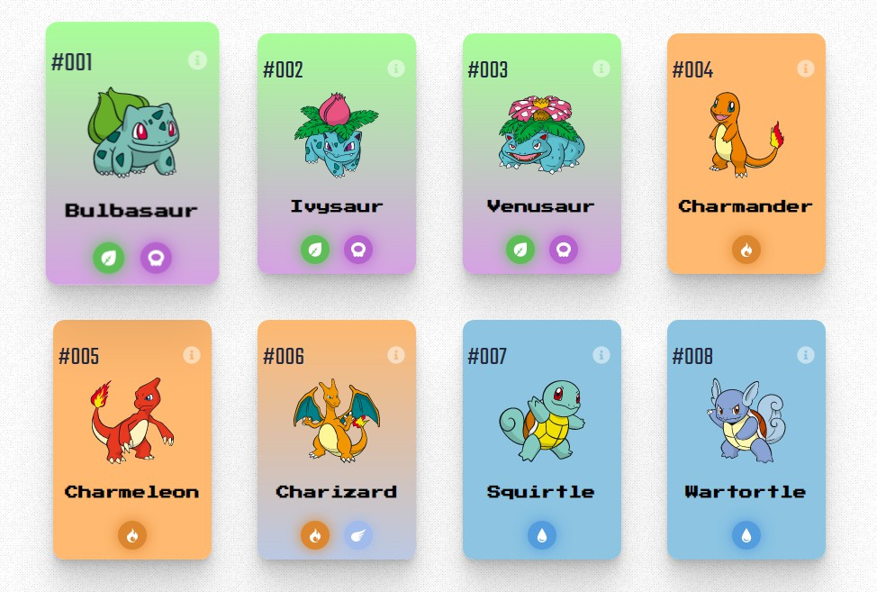
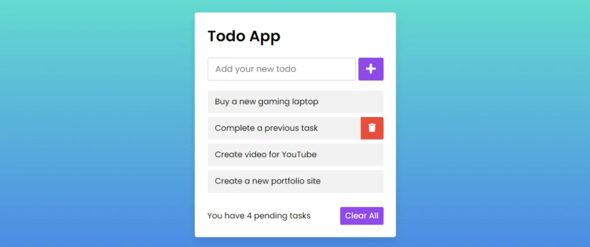

# INICIANDO NO REACT JS EM 2022

O React é uma biblioteca para facilitar a criação de interfaces gráficas na web. Com ele podemos escrever nosso código de UI em componentes de forma declarativa e focada.

O React também é bem popular no mercado, possuindo muitas vagas disponíveis e salários interessantes. Tudo isso torna o React um bom tópico de aprendizado, porém é necessário ter alguns conhecimentos base para começar no React com o pé direito. Nesta postagem falarei sobre esses conhecimentos e algumas coisas mais.


## A BASE

Para começar a estudar React é **necessário** que você já tenha um certo conhecimento do Javascript. Isso porque o React é uma biblioteca Javascript...

Com isso dito, eu também acho que não seja necessário ser um mestre do Javascript Puro para começar a se aventurar.

**Os tópicos a seguir estão classificados com essas estrelinhas aqui**

<br />

⭐ = Leia um pouco sobre, tente entender a ideia geral, mas não se preocupe
em aprofundar os conhecimentos (de começo).

<br />
⭐⭐ = Leia e pratique um pouco em alguma aplicação pequena para fixar mais a ideia.

<br />
⭐⭐⭐ = Leia e preste bastante atenção, é um assunto recorrente no dia a dia e vai
fazer uma diferença significativa na sua vida.

<br />

**Na minha opinião, você já pode começar a ver o React depois que:**

- ⭐⭐⭐ Entender a sintaxe base do Javascript (variáveis, condicionais, estruturas de repetição, arrays, objetos, funções).

> Necessário para alcançar seus objetivos básicos com a linguagem.

- ⭐⭐ Entender a tipagem peculiar do Javascript e absorver a ideia de que tudo é um objeto.

> Essa é uma etapa importante, absorva a estranheza do Javascript (se você veio de outra linguagem) ou torne-se parte dela (se essa é a sua primeira linguagem).

- ⭐⭐ Entender o conceito de escopo no Javascript (let, const e o que acontece com seus valores quando uma função termina de executar).

> Ajuda a entender o porque algumas coisas são como são no React e também porque é um conceito muito relevante no Javascript.

- ⭐ Pesquisar um pouco sobre o que é o paradigma funcional.

> Isso vai também vai te ajudar a se sentir mais confortável com a forma que o React trabalha. Não precisa ir muito a fundo, leia um pouco sobre o conceito, só o suficiente para não ficar perdido(a).

- ⭐⭐ Entender os principais métodos de array do JS (map, filter e reduce).

> Esses métodos já utilizam algumas ideias do paradigma funcional que eu comentei antes. Eles são utilizados a todo momento, aprenda o que eles fazem e para que servem e com o tempo a sintaxe se torna natural

- ⭐⭐⭐ Entender como funciona código assíncrono em Javascript (then, async, await)

> Nós vamos trabalhar com isso frequentemente, principalmente quando precisamos de chamar APIs (o que acontece o tempo todo).

- ⭐⭐ Entender como funcionar o método Fetch no Javascript (requisições HTTP)

- ⭐⭐⭐ Entender a ideia de tratar funções como qualquer outro valor para outras funções (callbacks)

> Estamos usando callbacks o tempo todo também. Usamos para lidar com eventos como os de click ou input, usamos para deixar componentes mais flexíveis e etc etc etc.

- ⭐⭐ Entender o básico de manipulação do DOM (criar elementos, alterar elementos, apagar elementos e etc)

> Isso vai te ajudar a entender o que o React faz e onde ele pode te ajudar. Minha dica é construir algo como um ToDo List com Javascript, HTML e CSS puros e depois ir fuçando para entender melhor.

- ⭐⭐ Import e Export

> Necessário para reutilizar código que está em outros arquivos.

Com isso você já vai ser capaz de lidar com o Javascript, mexer no DOM, usar APIs e etc.

**Ideias de projetos pequenos que podem te ajudar a entender esses tópicos**

- Um site de consulta de Pokémon's utilizando a PokeApi. O usuário digita o nome do Pokémon e um card é mostrado com suas informações.



- Uma lista de tarefas onde podemos adicionar tarefas, remover tarefas e filtrar entre feitas e não feitas.



- Um formulário de login com validações para senha e e-mail.


Se você já sabe outras linguagem de programação isso provavelmente vai ser tranquilo. Se você já sabe um pouco de Javascript basta dar uma checada no que você não entende bem e seguir o baile.

Lembrando que não é necessário sabe tudo sobre todas essas coisas, mas ter uma noção base de para que serve, como usar e entender um pouco sobre como funciona vai te ajudar muito com as tarefas que fará quando estiver construindo o frontend de aplicações web com o React (ou qualquer outra biblioteca).

Agora podemos partir para o React.

## REACT JS

Antes de começar um projeto local você vai precisar ter o `Node JS`e o `NPM` instalados na sua máquina. Se você ainda não sabe o que são essas coisas, agora é uma boa hora para pesquisar e estudar um pouco.

Agora também é um bom momento para falar que no desenvolvimento frontend moderno nós utilizamos múltiplas ferramentas que melhoram tanto a experiência de desenvolvimento quanto a experiência do cliente. Tendo isso em mente é importante saber que quando trabalhamos com o React é comum ouvir falar de `bundlers`, `compilers`, `formatters` e `linters`.

Você **NÃO** precisa se preocupar com isso no começo, mas para evitar a confusão que não entender o que significa tudo isso causa podemos ver um pequeno resumo sobre isso:

- `bundler`: Uma ferramente que pega o seu código e as dependências dele e separa em um ou mais arquivos que poderão ser utilizados em produção (idealmente). Ex: Rollup, Webpack.

- `compiler / compilador`: Uma ferramenta que recebe um código como entrada e cospe outro como saída. No mundo Javascript é comum escrever Javascript moderno e passar esse código por um compilador que gera um Javascript mais antigo, mas que é mais compatível com os navegadores. Ex: SWC, BabelJS.

- `formatter`: Uma ferramenta que deixa o seu código formatado com um determinado estilo. Ex: Prettier.

- `linter`: Uma ferramenta que escaneia seu código para indicar possíveis erros, bugs, problemas na escrita e construções suspeitas. Basicamente uma ferramenta que fica julgando o seu código. Ex: ESLint.

Essa explicação deve ser o suficiente para pelo menos não ficar totalmente perdido quando escutar essas palavras peculiares.

Em 2022 recomendo iniciar seus projetos com a ferramenta [Vite JS](https://vitejs.dev/). Ela vai montar um esqueleto básico para você começar, vem com um servidor de desenvolvimento para que você veja suas alterações em tempo real, vai trazer um bundler pré-configurado (Rollup) para preparar seu projeto para produção e etc.

Essa etapa de preparar o projeto para produção é o `build`.

Também é comum ver coisas como `JSX` (XML + JS, aquele HTML no meio do código Javascript), importações de imagens e outros arquivos que não são possíveis de importar normalmente e etc. Essas importações são possíveis por conta do uso do _bundler_ e do _compilador_

### Seu primeiro componente

**Um componente React é literalmente uma função Javascript que retorna JSX.**

```js
// Note que o nome da função começa com letra maiúscula
function MeuComponente() {
	return <h1>Oi mãe!</h1>;
}

export { MeuComponente };
```

> O nome da função começa com letra maiúscula para que possamos utilizar essa função como uma tag JSX e não confundir ela com uma tag comum.

```js
import { MeuComponente } from './MeuComponente.js';

function App() {
	return (
		<div>
			<MeuComponente />
		</div>
	);
}

// Resulta em <div> <h1> Olá mãe </h1> </div>
```

O React cria HTML no navegador usando Javascript, por isso que no arquivo `index.html` que o Vite cria a só vemos uma `<div id="root"><div>` vazia no documento.

> O processo de criar e alterar o HTML de um componente é chamado de **renderização** e toda vez que um componente muda ele é renderizado outra vez.

Para que esse componente realmente seja renderizado nós temos que chamar o método `render` e especificar um elemento na qual tudo vai ser colocado.

```js
import React from 'react';
import ReactDOM from 'react-dom';
import App from './App.js';

ReactDOM.render(
	<React.StrictMode>
		<App />
	</React.StrictMode>,
	document.getElementById('root')
);
```

O esqueleto que o Vite traz já monta isso para nós, então basta seguir a vida.

### JSX

Apesar de parecer muito com HTML ele não é a mesma coisa.

Algumas coisas no JSX são diferentes. Coisas do HTML que usam palavras reservadas do Javascript tem outros nomes aqui, coisas separadas por hifens, dois pontos e etc, agora estão em camelCase e por aí vai.

O JSX não é compreendido pelo navegador, então compiladores irão transformar esse JSX em funções Javascript válidas.

```js
function Gatinho() {
	return <h1>Miau</h1>;
}
```

Se transforma em:

```js
function Gatinho() {
	return React.createElement('h1', null, 'Miau');
}
```

Utilizamos o JSX pela praticidade. Mas você tem a total liberdade de escrever coisas como no resultado mostrado.

### HOOKS


Um hook é uma função Javascript que só funciona dentro de um componente. Eles são
assim pois dependem de coisas específicas que acontecem dentro das funções que retornam
JSX, por isso não funcionam em uma função comum.

**É uma convenção adicionar a palavra `use` no começo do nome de um hook. Você pode usar essa informação para reconhecer um hook.**

Podemos utilizar ganchos (Hooks) para adicionar funcionalidades aos nossos componentes. Como por exemplo o gerenciamento local de estado que é trazido para nós com o `useState()`:

```js
function Olá() {
	const [estado, setEstado] = useState('Olá mundo!');
	// Quando clicamos no botão o seu conteúdo muda de "Olá mundo!" para "Olá mãe!"
	return <button onClick={() => setEstado('Olá mãe!')}>{estado}</button>;
}
```

Lembra que no começo eu falei que o React nos permite criar componentes de forma declarativa?

Com _declarativa_ eu quero dizer que ao invés de escrever isso:

```js
// Cria um título e um botão
const titulo = document.createElement('h1');
const botão = document.createElement('button');
botão.textContent = 'Clique em mim';

// Inicia o contador
let contador = 0;
titulo.textContent = `Contagem: ${contador}`;

// Adiciona o evento de clique que altera o título
botão.addEventListener('click', () => {
	contador++;
	titulo.textContent = `Contagem: ${contador}`;
});

// Ignorando a adição dos elementos ao DOM
```

Você vai escrever isso:

```js
function Contador() {
  const [contador, setContador] = useState(0);

  return (
    <>
      <h1>Contagem: {contador}</h1>
      <button onClick = {() => setContador(contador + 1)}>
        Clique em mim
      </button>
    <>
  );
}

// Ignorando a parte do render
```

Nós literalmente declaramos o que deve ser mostrado e quando alteramos o valor de `contador` nosso elemento _reage_, rodando a função do componente outra vez e retornando o JSX com o novo conteúdo (resumindo: renderiza o novo valor no componente).

**Além do `useState` temos muitos outros hooks**

- useEffect
- useCallback
- useContext
- useReducer
- useMemo
- etc...

Você também pode criar os seus próprios hooks e usar eles em seus componentes, mas isso vai ficar para a próxima.

> Boa sorte nos estudos para nós, pois eu também estou estudando isso aqui :D

## Links

- [Rundown of the most important react hooks](https://betterprogramming.pub/rundown-of-the-most-important-react-hooks-5c9ec4cac5a2)
- [O que é JSX?](https://www.treinaweb.com.br/blog/o-que-e-jsx)
- [How JavaScript bundlers work](https://medium.com/@gimenete/how-javascript-bundlers-work-1fc0d0caf2da)
- [ViteJS](https://vitejs.dev/)
- [SWC](https://swc.rs/)
- [Babel JS](https://babeljs.io/)
- [Prettier](https://prettier.io/)
- [ESLint](https://eslint.org/)
- [Introdução aos hooks](https://pt-br.reactjs.org/docs/hooks-intro.html)
- [ReactJS](https://pt-br.reactjs.org/)
- Vozes da minha cabeça
