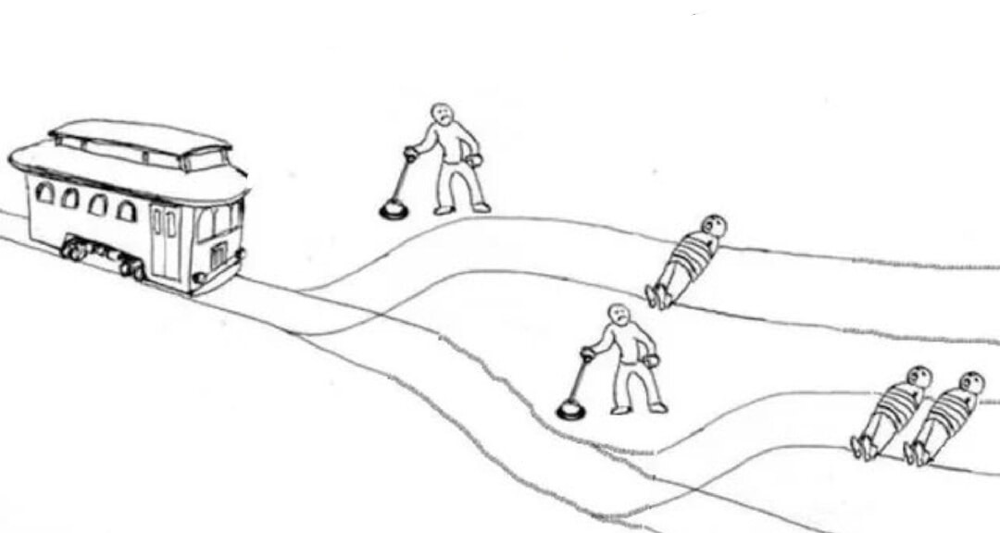
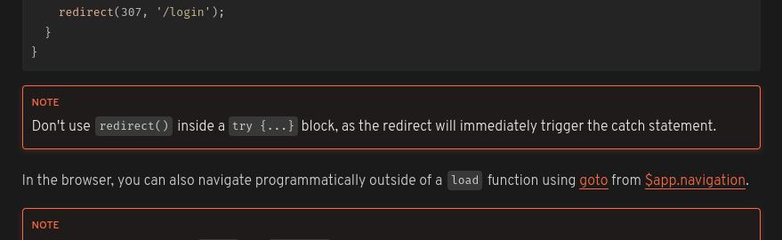

# Javascript Otimista e o tratamento de Erros e Exceções


> Sim, essa imagem foi gerada por IA pois o autor é falido e não sabe desenhar.

Desenvolvedores Javascript (Typescript também) costumam ser muito otimistas. Não necessáriamente na vida, mas com código são. Eles acreditam nas funções com uma fé sobrehumana. Eu estou falando especialmente sobre como muitos lidam com funções que retornam promessas, sim as tais promises que a gente usa todos os dias infinitas vezes.

Aqui está um exemplo de como um desenvolvedor Javascript otimista faz a busca de dados em uma API:

```javascript
async function getSomeData() {
  const response = await fetch('/some-data');

  if (!response.ok) {
    return [];
  }

  return response.json();
}
```

Talvez você já tenha reparado no problema gritante que existe nesse código. Ele é otimista demais, acredita que nada pode dar errado e portanto não trata absolutamente nenhum erro (além de um erro de rede).

Vamos pensar no que pode dar errado nesse código:

- A requisição pode falhar por um erro de rede
- A requisição pode retornar algo como um 404 ou 500 e isso não é um erro de rede então não vai cair no !response.ok, mas pode não ser o que você espera
- O payload da resposta pode não ser um JSON válido e o `response.json()` vai lançar uma exceção
- O payload pode ser um JSON válido, mas não ser um array e isso não é o que você espera

Aqui está uma versão mais realista do código acima:

```javascript
async function getSomeData() {
  try {
    const response = await fetch('/some-data');

    if (!response.ok || response.status !== 200) {
      return [];
    }

    const data = await response.json();

    if (!Array.isArray(data)) {
      return [];
    }

    return data;
  } catch (error) {
    return [];
  }
}
```

Agora sim, o código trata os possíveis casos de erro e não vai quebrar a aplicação. Ele ainda é otimista, mas agora é um otimista realista.

Um dos principais problemas do código acima é que ele faz o uso de um anti-pattern conhecido como `try, catch e cala boca`. O `try, catch e cala boca` é um bloco de código que tenta fazer alguma coisa e se der erro, ele simplesmente silencia erro e continua a execução do código.

O `try, catch e cala boca` é um anti-pattern porque ele esconde erros. Se algo der errado, o código vai continuar a execução como se nada tivesse acontecido e pior ainda, sem que ninguém saiba que algo deu errado. Você prefere uma mensagem de erro ou um comportamento misterioso?


Vamos alterar o código acima mantendo a mesma lógica, mas sem usar o `try, catch e cala boca`:

> No nosso código você já deve ter percebido que estamos sempre retornando um array vazio quando algo dá errado. Isso é uma decisão de design. Em alguns casos, retornar um valor padrão é o quevocê quer fazer. Em outros casos, pode ser melhor lançar uma exceção. Isso depende do contexto. O importante é que o código trate os casos de erro.

```javascript
// logger.js
function logError(error) {
  console.error(error);
}

// api.js
import { logError } from './logger.js';

async function getSomeData() {
  async function getSomeData() {
    try {
      const response = await fetch('/some-data');

      if (!response.ok || response.status !== 200) {
        logError(new Error('Request failed'));
        return [];
      }

      const data = await response.json();

      if (!Array.isArray(data)) {
        logError(new Error('Invalid response'));
        return [];
      }

      return data;
    } catch (error) {
      logError(error instanceof Error ? error : new Error(`Unknown error: ${String(error)}`));
      return [];
    }
  }
}
```

Agora o código retorna um array vazio quando acontece algo errado e não esconde os erros. Se der ruim, o código vai enviar a mensagem de erro para o logger e continuar a execução. O logger é responsável por mostrar a mensagem de erro para o usuário ou salvar em um arquivo de log, por exemplo.

O que fizemos acima foi programar de forma mais defensiva. O código acima tem mais linhas de código do que o código original, mas ele é mais seguro. Ele também é mais lento, afinal quanto menos código é executado, mais rápido é a execução (geralmente) e estamos executando mais código.

Talvez você possa simplesmente confiar na API que você está consultando e remover algumas checagens, mas isso é uma decisão que você tem que tomar. Aí já é contigo meu colega de ofício.


> No código acima nós nunca passamos o erro adiante, dependendo do caso essa é a decisão ideal como eu disse antes. Se você está tentando pedir sua janta num aplicativo, todo brocado de fome, você não vai querer que o aplicativo pare de funcionar porque a busca de comentários não está funcionando. É melhor não mostrar os comentários e mostrar uma mensagem de erro ou simplesmente não mostrar os comentários.

Em alguns outros casos você não quer esse comportamento, talvez você queira passar o erro adiante, encerrar a execução do código ou mostrar uma mensagem de erro para o usuário. Isso também `depende®` do que você está fazendo.

Se você deseja passar o erro adiante o Javascript/Typescript te disponibiliza o nosso não tão quero amigo `throw`. O `throw` é uma palavra reservada que você pode usar para lançar uma exceção. Quando você lança uma exceção, o código para de executar e o erro é passado adiante.

```javascript
async function getSomeData() {
  const response = await fetch('/some-data');

  if (!response.ok || response.status !== 200) {
    throw new Error('Request failed');
  }

  const data = await response.json();

  if (!Array.isArray(data)) {
    throw new Error('Invalid response');
  }

  return data;
}
```

Essa é uma política meio `dobra e passa pro próximo`. Se algo der errado, lançamos uma exceção e para a execução da função atual. Se nada der errado, retornamos os dados. O código que chama a função `getSomeData` é responsável por tratar a exceção.



```javascript
import { getSomeData } from './api.js';
import { logError } from './logger.js';

try {
  const data = await getSomeData();
  console.log(data);
} catch (error) {
  logError(error);
}
```

O código acima tem um problema que na verdade está nas veias do Javascript: **Nem o Javascript, nem o Typescript tem mecanismos na linguagem que te avisam que uma função pode lançar uma exceção, nem que tipo de exceção ela pode lançar e muitos menos algo que force você a tratar essa exceção.**

Agora vamos ao momento de reflexão.

### "Nem o Javascript, nem o Typescript tem mecanismos na linguagem que te avisem que uma função pode lançar uma exceção..."

Isso é verdade. Nem mesmo usando Typescript você consegue saber se uma função pode lançar uma exceção. Isso é triste porque você não sabe se precisa tratar uma exceção ou não. Você tem que ler a documentação da função ou o código fonte dela para saber se ela pode lançar uma exceção.

Isso pode te levar a:

- Tratar exceções que nunca vão acontecer
- Não tratar exceções que podem acontecer

Uma solução para esse problema é usar o JSDoc para documentar que uma função pode lançar uma exceção. O JSDoc é um formato de comentário que você pode usar para documentar funções, variáveis, etc. O Typescript inclusive é capaz de usar o JSDoc para inferir tipos de variáveis e funções.

```javascript
/**
 * @throws {TypeError} - Se houver um erro de rede
 * @throws {Error} - Se o response não for ok ou se o status não for 200
 * @throws {SyntaxError} - Se a resposta não for um JSON válido
 * @throws {Error} - Se a resposta não for um array
 * @returns {Promise<Array>}
 */
async function getSomeData() {
  const response = await fetch('/some-data');

  if (!response.ok || response.status !== 200) {
    throw new Error('Request failed');
  }

  const data = await response.json();

  if (!Array.isArray(data)) {
    throw new Error('Invalid response');
  }

  return data;
}
```

Isso é bom o suficiente? Não. Isso é uma solução paliativa. O JSDoc não é uma ferramenta que te avisa que você precisa tratar uma exceção ela só deixa aí pra quem quiser ver que a função pode lançar uma exceção. Se você não ler o pau vai comer e fim.

### "... nem que tipo de exceção ela pode lançar..."

Isso acontece porque no Javascript/Typescript você pode lançar qualquer coisa como exceção. Você pode lançar um número, uma string, um objeto, o que vier na sua cabeça. Isso é até usado por frameworks famosos como o [SvelteKit](https://kit.svelte.dev/docs) para [lançar um redirect](https://kit.svelte.dev/docs/load#redirects) usando `throw` e encerrar a execução do código daquele ponto em diante enquanto o próprio framework trata essa _"exceção"_ e faz o redirect.



Por isso que nós geralmente temos que encher os blocos `catch` de `if (error instanceof SomeErrorClass) { ... }` para saber que tipo de erro estamos tratando. Existe até uma proposta no TC39 chamada [ECMAScript Catch Guards](https://github.com/wmsbill/proposal-catch-guards) que visa resolver esse problema.

> A proposta esta em estágio 0 então melhor não contar com ela.

### "... e muitos menos algo que enforce que você precisa tratar essa exceção."

Talvez você já tenha ouvido falar de linguagens como o Java que te obriga a tratar uma exceção ou lançar ela adiante e deixar isso claro na assinatura da função ou linguagens como Go que retornam o erro como um valor e você tem que ficar checando a cada ponto que dá erro. Isso é uma feature da linguagem. O Javascript/Typescript não tem isso. Você pode lançar uma exceção e não tratar ela.

Alguns até diriam que isso é um feature do JS/TS, afinal dá para ir bem rápido se você ignorar todos os sinais de transito e não parar nos sinais vermelhos.


Talvez exista alguma forma de fazer com que o seu linter pegue funções que lançam exceções e te avise que você precisa tratar elas, mas eu não conheço nenhuma forma de fazer isso.

Você sempre pode esquecer de tratar uma exceção e isso pode quebrar a aplicação.

Existe um jeito de minimizar esse problema. Você pode passar o erro adiante como um `Result` ou `Either` e forçar quem chama a função a tratar o erro para obter o valor. Essa é uma feature comum de linguagens de programação funcionais e não existe por padrão no Javascript/Typescript, mas você pode implementar isso.

```javascript
type Result<T, E> = { type: "ok"; value: T } | { type: "error"; error: E };

async function getSomeData(): Promise<Result<unknown[], Error>> {
  const response = await fetch("/some-data");

  if (!response.ok || response.status !== 200) {
    return { type: "error", error: new Error("Request failed") };
  }

  const data = await response.json();

  if (!Array.isArray(data)) {
    return { type: "error", error: new Error("Invalid response") };
  }

  return { type: "ok", value: data };
}
```

Agora quem chama a função `getSomeData` é obrigado a tratar o erro para obter o valor.

```javascript
const result = await getSomeData();

if (result.type === 'ok') {
  console.log(result.value);
} else {
  logError(result.error);
}
```

Isso ainda não resolve o problema completamente porque ainda é possível que você esqueça de tratar algum erro e ao invés de retornar um `Result` a função simplesmente quebre e é isso aí.

## Conclusão

O tratamento de erros e exceções é um assunto complexo e que pode ser difícil de entender. O Javascript/Typescript não te ajuda muito nesse sentido. Você tem que tomar cuidado e ficar mais consciente do que você está fazendo.

- Não, colocar todo o seu código dentro de um só `try, catch` não é uma boa ideia.
- Se você está lidando com `promises`, fique atento, promessas podem ser rejeitadas e você tem que tratar isso.
- Se você está usando algo como `React` dê uma olhada no conceito de [`Error Boundaries`](https://react.dev/reference/react/Component#catching-rendering-errors-with-an-error-boundary) para lidar com erros de renderização.
- Se você está usando `Node.js`, dê uma olhada nos eventos como [`uncaughtException` e `unhandledRejection`](https://nodejs.org/api/process.html#warning-using-uncaughtexception-correctly) para lidar com erros não tratados.
- Explore soluções como [`Result` e `Either`](https://blog.rockthejvm.com/functional-error-handling-in-kotlin-part-2/).
- Documente suas funções com [JSDoc para deixar claro que uma função pode lançar uma exceção](https://jsdoc.app/tags-throws).
- Reporte erros para o usuário de forma clara e objetiva.
- Reporte erros para o seu logger para que você possa investigar o que deu errado. Monitorar erros é importante.
- Usando [tanstack query v5](https://tanstack.com/query/latest) você pode usar o `onError` para tratar erros de promises.
- No [Next.js v14](https://nextjs.org/docs/app/building-your-application/routing/error-handling) você pode usar o arquivo `error.tsx` para tratar erros.
- No [SvelteKit v2](https://kit.svelte.dev/docs/routing#error) você pode fazer algo bem parecido com o Next.js usando o `+error.svelte`.

```txt
Porque a confiança é uma mulher ingrata
Que te beija e te abraça, te rouba e te mata

- Desenvolvedor Javascript as sete da noite subindo uma correção para um erro que ele não tratou.
```
