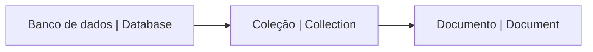

# Iniciando com o MongoDB


## O que é o MongoDB?

MongoDB é um banco de dados NoSQL, ou seja, não relacional. Ele é um banco de dados **orientado a documentos**, guardando os dados em objetos com um formato _baseado em JSON_.

Esses documentos são armazenados em coleções, que são agrupamentos de documentos. Por sua vez, essas coleções são armazenadas em bancos de dados.



## 📄 Documentos

Os documentos são objetos JSON que são armazenados no MongoDB.

Na verdade não é um JSON puro, o Mongo usa um formato binário chamado BSON, esse formato adiciona alguns tipos de dados que não existem no JSON, como por exemplo, o tipo Date. Geralmente não trabalhamos com BSON diretamente, ao invés disso usamos objetos nativos da linguagem de programação que estamos usando.

Um exemplo de documento seria:

```json
{
  "_id": "algum_id",
  "name": "João",
  "age": 20,
  "hobbies": ["truco", "jardinagem"],
  "address": {
    "street": "Logo ali",
    "number": 123
  }
}
```

**Vantagens:**

- Não precisa de um esquema pré-definido
- É fácil de escalar horizontalmente (basta adicionar mais servidores)
- Documentos correspondem a objetos nativos do JavaScript e em muitas linguagens de programação
- Documentos embutidos reduzem o número de consultas necessárias

### Sobre os nomes dos campos

Os nomes de campos são strings que designam um valor. O nome do campo não pode ser vazio.

> info: O nome do campo `_id` é reservado para o identificador único do documento. O identificador único é obrigatório e deve ser único para cada documento em uma coleção. O identificador único pode ser de qualquer tipo, mas é comumente uma string ou um número inteiro.

### Limites de tamanho

Um objeto BSON pode ter no máximo 16 megabytes (MB). A maioria dos documentos não chega nem perto desse limite, mas se você estiver trabalhando com documentos muito grandes, talvez seja necessário considerar um design alternativo.

> "Ah, mas eu quero guardar blobs gigantes de 100MB no MongoDB" - Você, provavelmente

Para isso, o MongoDB tem um tipo de dado chamado `BinData`, que é um array de bytes. Você pode usar esse tipo de dado para guardar blobs grandes. Neste caso o Mongo não vai guardar todo o seu blob em um único documento, ele vai dividir em vários documentos menores de 255 Kilobytes (KB).

> tip: Considere também a possibilidade de guardar o seu blob em um serviço de armazenamento de arquivos, como o [Amazon S3](https://aws.amazon.com/pt/s3/), e guardar apenas o link para o arquivo no MongoDB.

[👉 Você poder saber mais sobre isso clicando aqui 👈](https://www.mongodb.com/developer/products/mongodb/storing-large-objects-and-files/)

### Ordem de campos

- O campos são ordenados
- Pode ocorrer reordenação dos campos durante leitura, então você não deve confiar na ordem dos campos
- Durante escrita a ordem dos campos é preservada, com exceção do campo `_id`, que sempre é o primeiro campo
- Updates que renomeiam campos podem causar reordenação dos campos

[Aprenda mais sobre documentos no MongoDB na documentação](https://www.mongodb.com/docs/manual/core/document/)

## 📖 Coleções


Coleções são agrupamentos de documentos. Elas são análogas às tabelas em bancos de dados relacionais.

Você pode criar uma coleção usando o método `createCollection`:

```js
db.createCollection("users");
```

> info: Se você tentar inserir um documento em uma coleção que não existe, o MongoDB vai criar a coleção automaticamente.

Uma coleção não precisa ter um Schema, mas se você quiser validar os dados durante uma `insert` ou `update`, você pode definir um.

[Aprenda mais sobre validação de schems na documentação](https://www.mongodb.com/docs/manual/core/schema-validation/)

> "Vixe! Antes eu só guardava nome e email na coleção de usuários, agora preciso adicionar senha... Como faço?" - Algum desenvolvedor esquecido

Você vai ter que atualizar todos os documentos da coleção para adicionar o campo senha. Você pode fazer isso usando o método `updateMany`:

```js
db.updateMany(
  // Query (vazio para aplicar a todas as coleções)
  {},
  // Update
  {
    $set: {
      password:
        "que valor você colocaria para algo sensível assim eu num sei... talvez null?",
    },
  },
);
```

## TODO

- Query API

  - [ ] CRUD operations
  - [ ] Aggregation pipeline
  - [ ] Combinar dados de coleções diferentes
  - [ ] Full text search

- Data modeling

  - [ ] Modelagem de dados
  - [ ] Modelagem de relacionamentos
  - [ ] Referências

- Transactions
- Indexes
- Mongoose
